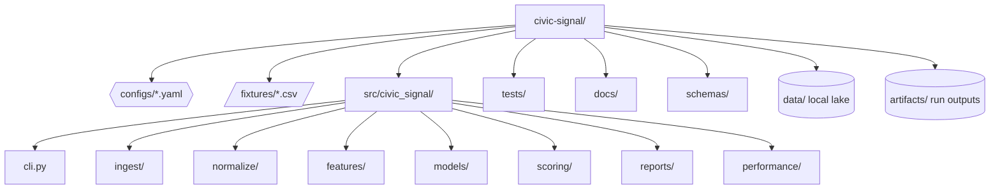
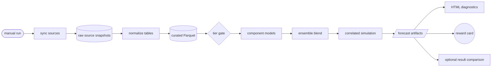
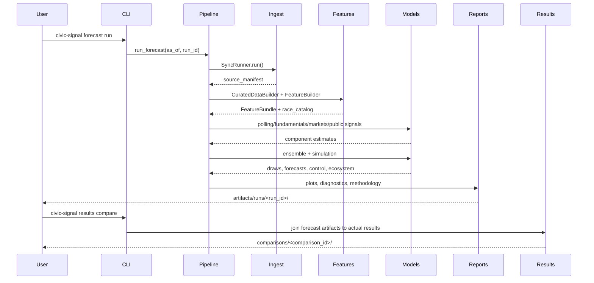
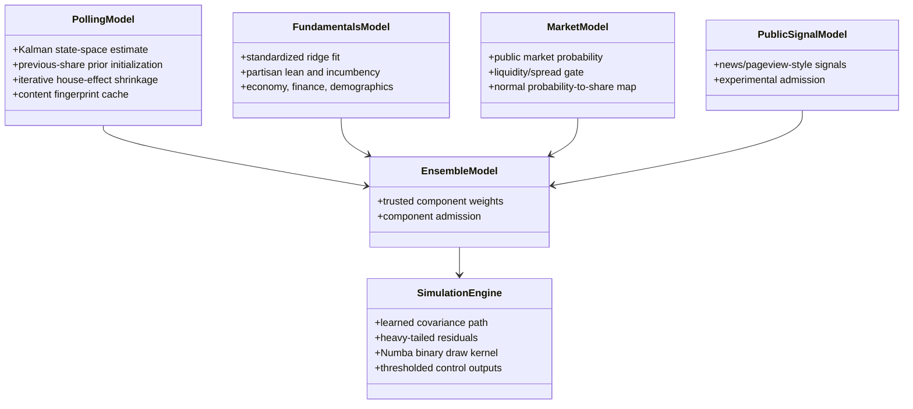
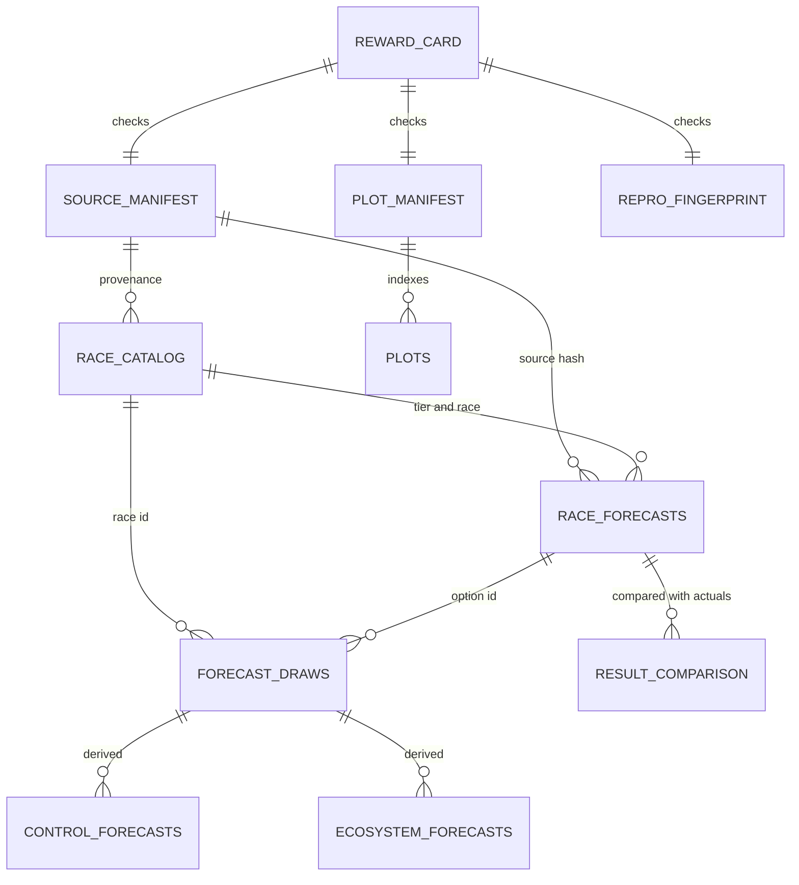

# Civic Signal

<p align="center">
  
</p>

Civic Signal is a CLI-first U.S. election forecasting engine intended as a
Python-native alternative that builds on the Economist-style Bayesian election-modeling
lineage. It starts from the same broad forecasting problem: combine polls,
fundamentals, public signals, and uncertainty-aware simulation into a coherent
probabilistic forecast. The repo then extends that baseline into a broader engineering
surface for repeatable source sync, race normalization, component admission,
calibration, diagnostics, and reproducibility checks.

The project is also a methodology benchmark harness, not only one forecasting recipe.
It compares Bayesian state-space inference, analytic/Kalman baselines, rolling-origin
calibration, source coverage, forecast-vs-actual scoring, Silver/FiveThirtyEight-style
methodology readiness, and simulation-throughput performance. The intended
improvements are explicit: broader race and office coverage, row-level provenance,
sparse-race honesty, calibrated probability publication, reproducible run artifacts,
model cards, reward gates, and benchmarkable performance.

The implementation is deliberately Python-native and performance-aware. The current
Bayesian path uses the Pyro-family NumPyro/JAX stack with compact hierarchical NUTS;
table work is built around Polars/DuckDB patterns; repeated numerical simulation uses
Numba and parallel kernels when practical. The backend contracts are artifact-oriented
so future Pyro/PyTorch, NumPyro/JAX, analytic, or other inference engines can be
benchmarked against the same CLI workflows and output schemas.

The current default run is deterministic and fixture-backed so the full artifact,
plotting, reward, and benchmark contract can be tested before broader live adapters are
added. The presidential benchmark includes 50 states plus DC for 2000-2024 and supports
full Electoral College simulation.

Core project documents:

- [`SPEC.md`](SPEC.md): durable implementation contract.
- [`AGENTS.md`](AGENTS.md): required agent operating rules.
- [`docs/REAL_WORLD_FORECASTER_ENHANCEMENT_PLAN.md`](docs/REAL_WORLD_FORECASTER_ENHANCEMENT_PLAN.md):
  dependency-ordered real-data methodology roadmap and reward-v2 verification contract.
- [`docs/technical_appendix.md`](docs/technical_appendix.md): model details.
- [`docs/performance.md`](docs/performance.md): Numba and performance contract.
- [`docs/api_requirements.md`](docs/api_requirements.md): live-ingestion API notes.

## Package Initialization And Installation

Prerequisites:

- Python managed through `uv`.
- macOS/Linux shell.
- No API keys are required for default fixture-backed runs.

Install the package and local environment:

```bash
uv sync
chflags -R nohidden .venv
```

The `chflags` command is included because this macOS environment has repeatedly hidden
`.venv` metadata after package syncs, which can break editable imports.
If `uv run civic-signal --help` raises `ModuleNotFoundError` after a plain `uv sync`
because the local interpreter did not process uv's editable path file, run CLI commands
with `PYTHONPATH=src` prefixed, for example:

```bash
PYTHONPATH=src uv run civic-signal forecast run --help
```

Validate the repo:

```bash
uv run ruff check
uv run ruff format --check
uv run pytest --cov=src/civic_signal --cov-fail-under=90
```

The pytest configuration declares `pythonpath = ["src"]`, so the coverage command can
be run without a shell-level `PYTHONPATH` override.

## Core Workflows

These are the commands to use most often.

### 1. Full Forecast

Run a complete forecast with diagnostics, plots, reward card, and reproducibility
fingerprint:

```bash
uv run civic-signal forecast run \
  --as-of 2026-05-08 \
  --run-id full-forecast
```

The default polling engine is resolved from `configs/model.yaml`.
The fixture registry remains the default for deterministic local validation. For a web-only
production candidate, pass `--sources-config sources_public_web.yaml`; that registry contains
free HTTPS sources explicitly marked `free_public_web`. Its initial adapters are keyless,
but a freely issued API key is also eligible when auth mode, limits, and terms are recorded.
It inherits only the production-only `sources_official_results.yaml` registry, never the
fixture registry. That implemented historical path snapshots a commit-pinned MEDSL
1976-2018 House constituency file sourced from the Office of the Clerk, then emits canonical
House race and official-result rows. The underlying Clerk returns are federal public records;
MEDSL requests dataset citation but does not publish an explicit data-license file in that
repository, so Civic Signal records the citation and terms URL and never redistributes the raw
snapshot from version control.
Production R16 rejects local fixtures, generated rows, paid sources, unknown access policy,
or unreviewed terms metadata; authentication by itself is not a paid-data signal.
The Bayesian path is the production default **polling engine** in config for research
and operational engineering runs, so those forecasts emit Bayesian posterior artifacts.
**Publication mode defaults to `research`** (`configs/rewards.yaml`); fixture-backed
Phase 8 orchestration success is **not** evidence of public-production forecasting skill.
Public-production publication is hard-blocked until every required reward-v2 gate in the
`production` profile recomputes to `pass` from primary artifacts (see
`verify rewards --profile production`). Comparative live-scope scorecards remain research
diagnostics only. To force the legacy Kalman/state-space path, run:

```bash
uv run civic-signal forecast run \
  --as-of 2026-05-08 \
  --run-id kalman-polling-smoke \
  --inference-engine kalman
```

The Bayesian backend defaults to compact hierarchical NumPyro/NUTS with two vectorized
chains, 500 warmup iterations, 2,000 sampling iterations per chain, and a `0.99` target
acceptance probability. A plain `uv sync` installs JAX, NumPyro, and ArviZ. The
deterministic analytic bridge remains available for fast smoke runs by selecting it
explicitly:

Bayesian polling observations use explicit methodology and sponsor bias adjustments plus
mode/sponsor/nonsampling variance, a 7-day half-life, population quality weights, and
poll-age process variance before fitting the as-of latent state. Survey/question identity
deduplicates repeated option rows. Binary polls contribute one shared two-party contrast;
undecided/other mass is proportionally removed from the two-party estimand and inflates
uncertainty. Three-or-more-option polling estimands are withheld because the repository
does not yet implement a coherent K-category likelihood; normalized diagonal option fits
must not be presented as a real multiclass model. An incomplete binary question is also
excluded instead of fitting its sole option as independent evidence. These statuses propagate
through the full forecast: the affected race retains `original_tier`, is downgraded to Tier C,
receives an `estimand_support_status`, and publishes null winner probabilities even when
fundamentals or markets are otherwise available. Semantic publication verification rejects
any blocked estimand that is not Tier C or has a non-null probability. Exported Bayesian
draws are inflated from `as_of` to election day with
`bayesian.state_space.forecast_drift_sd_per_sqrt_day`, then constrained within each
race so binary shares are anti-correlated and sum to one. The simulator uses those
draws as race-level centers and still applies the configured national, region, office,
and heavy-tailed local forecast-error layers.

```bash
uv run civic-signal forecast run \
  --as-of 2026-05-08 \
  --run-id analytic-polling-smoke \
  --inference-engine bayes \
  --bayesian-backend analytic
```

If the runtime environment is missing NumPyro/JAX or NUTS exceeds the configured wall-clock timeout, the run
falls back through the configured policy and records that status in
`posterior_diagnostics.json`.

### Scientific CI (M7)

Property, numerical-parity, mutation, golden-fixture, contract-parity, and offline
canary checks recompute under one command:

```bash
uv run civic-signal verify scientific
# optional network canaries / tiny real NUTS smoke
uv run civic-signal verify scientific --live-canaries --nuts-smoke
```

Golden fixtures live in `tests/golden_fixtures/` (small election, chamber control,
multi-option race, quarantine failure, parity fingerprints). Pytest markers:
`nuts` (tiny real MCMC), `live` (network canaries). Default unit tests use offline
canary mocks so CI stays deterministic.

The required mutation suite corrupts the actual reward/publication verifier paths: it
removes a required reward-card schema field, injects duplicate forecast keys and
out-of-range probabilities, supplies stale calibration lineage, and violates the blocked
estimand publication gate. For each family, the checked-in verifier must reject the
corruption while a controlled predicate-removal mutant accepts it. `verify scientific`
fails closed if any required mutation family is absent or survives. R27 is generated from
the repository rather than maintained as a hand-written checklist: configured reward IDs
must match threshold entries and evaluator methods exactly, profiles may reference only
known rewards, README/SPEC must document every reward and required command, and the real
CLI decorators must expose those commands. Live free-web canaries and the tiny real NUTS
smoke remain optional additions to the deterministic offline gate.

Run the bounded Bayesian model-recovery harness separately:

```bash
uv run civic-signal verify recovery \
  --backend analytic \
  --replicates 12 \
  --run-id recovery-smoke
```

This exercises the real Bayesian polling model with parameter-recovery, label-swap,
unpolled-propagation, and small simulation-based-calibration checks. Polled signed swings
are partially pooled at global, office, and geography levels into fundamentals-only races;
`bayesian.state_space.unpolled_pooling_prior_races` controls shrinkage toward zero. The
result is intentionally `insufficient_evidence` for production R20: the command writes
bounded smoke details under `artifacts/recovery/<run-id>/`, while the top-level R20 proof
fields remain null until large repeated SBC, real NUTS hierarchy recovery, and complete
control-bearing catalog evidence exist. The same command writes
`covariance_recovery.json` and `covariance_recovery.parquet`: a fixed-seed known-factor
experiment checks PSD construction, factor-variance error, correlation RMSE, label reversal,
and complementary-option invariance against preregistered tolerances. It remains explicitly
`production_sufficient=false`; a bounded synthetic panel is not large-cycle covariance proof.

Bounded hierarchy/parameter recovery smoke (always `production_sufficient=false`):

```bash
uv run civic-signal verify recovery --backend analytic --replicates 4
```

### Shadow forecasting (M8)

Shadow mode stores immutable, non-public forecasts for a declared window. It never
publishes production probabilities.

```bash
# Freeze model/baseline definitions before the evaluation window
uv run civic-signal shadow preregister --profile 2026-general-shadow --cycle 2026

# Materialize schedule only (or --execute to run each day)
uv run civic-signal shadow run \
  --profile 2026-general-shadow \
  --window-start 2026-05-01 \
  --window-end 2026-06-29 \
  --schedule-only

# Verify readiness: missing days / fallbacks / public-prob leaks cannot pass
uv run civic-signal verify shadow \
  --profile 2026-general-shadow \
  --window-start 2026-05-01 \
  --window-end 2026-06-29
```

Artifacts land under `artifacts/shadow/<profile>/` (`schedule_history.parquet`,
`preregistration.json`, `shadow_scorecard.json`, `shadow_readiness.json`). A full pass
requires either 60 consecutive completed days or the exact window dates explicitly
declared in the checked-in shadow profile, with frozen preregistration and no source-age /
fallback / silent-publication violations.
Scorecards remain observational (`insufficient_evidence` for “best evidenced” claims)
until nested multi-cycle comparators exist.

### Reward-v2 verification

Audit the production candidate registry and its fetched snapshots before building a
production-scoped forecast:

```bash
uv run civic-signal sync \
  --sources-config sources_official_results.yaml \
  --data-dir data/official-results
uv run civic-signal build-features \
  --sources-config sources_official_results.yaml \
  --data-dir data/official-results
uv run civic-signal data audit \
  --profile production \
  --sources-config sources_official_results.yaml \
  --data-dir data/official-results \
  --run-id official-results-audit
```

This standalone path is a real-data warehouse check, not a forecast publication claim.
`races.parquet` and `results.parquet` cover official-source House history through 2018;
current-cycle results, Senate/presidential official returns, and option/fundamental joins remain
separate milestones. Use `sources_public_web.yaml` when auditing the broader production
candidate registry after every configured source has been synced.

Recompute every reward from primary artifacts (never trust a previously written boolean):

```bash
uv run civic-signal verify rewards --profile production --run-id <run-id>
```

Recompute temporal integrity directly from the selected row-level lineage:

```bash
uv run civic-signal verify as-of --run-id <run-id>
```

Before tiering or model fitting, each time-varying table is filtered on event/observation,
publication, and availability time, then reduced to one deterministic eligible revision
per race/feature/option/horizon. Selection orders by observation time, publication time,
availability, revision id, and a stable row hash. Canonical snapshot identity coalesces
question/series/rating/finance IDs, so a nullable primary ID cannot collapse distinct
secondary series. File order cannot choose the winning revision.
Selected option-level finance and rating vintages overlay static option records only after
this cut; undated fundraising/rating values are excluded from the fundamentals model.
Economic conditions are converted once onto the incumbent-party axis and then onto each
option's party axis. Open major-party races require an explicit `incumbent_party`; without
one, their economic effect is neutral and the lineage proof remains incomplete.
Each forecast writes `selected_feature_lineage.parquet`, including selection keys,
snapshot ids, revision ids, and the selection predicate, plus `feature_lineage.json`.
`as_of_audit.json` is recomputed from those rows. R17 requires explicit availability,
unique selection keys, a matching lineage hash, and an adversarial canary that inserts
future revisions and reruns feature selection, tiering, and a deterministic forecast
fingerprint. Forecast runs now label this canary `exact_publication_pipeline`: the baseline
publication execution and a hostile-future counterfactual use the same active-bundle,
component, ensemble, posterior, `SimulationEngine`, race-probability, and control path.
The audit records separate hashes for posterior draws, component estimates, ensemble center,
race forecasts, and controls, and requires hostile rows in every nonempty time-varying table.
Production R17 rejects narrower scopes or any unchanged-output field that is not explicitly
true. When a source lacks record-level availability, ingestion conservatively uses retrieval
time; an event-date proxy is reported as implicit and cannot pass R17.

On a fixture-only or research run this command exits nonzero and lists real-data,
nested-backtest, and publication rewards as `fail` or `insufficient_evidence`.
Semantic publication checks refuse a `production` label without a verified
`promotion_manifest.json`:

```bash
uv run civic-signal verify publication --run-id <attempt-id> --profile production
```

Promotion attempts first recompute semantic_verification.json from the current
catalog, forecast, draw, control, and source artifacts, then recompute the required
rewards. Verification is read-only by default; it does not rewrite a promoted run.
Successful promotion creates a create-once immutable snapshot under
artifacts/promoted/<profile>/attempts/<attempt-id>/ and content-hashes the complete
set of present scientific and reward evidence files. Reusing an attempt ID or presenting
an incomplete hash manifest is rejected.

Thresholds and profile membership live only in `configs/rewards.yaml`. Forecast runs
write `reward_card.json` (legacy), `reward_card_v2.json`, `run_manifest.json` (with
`publication_mode`), `semantic_verification.json`, and `publication_decision.json`.

Open the main report:

```bash
open artifacts/runs/full-forecast/diagnostics.html
```

Verify a completed run's artifacts, plots, posterior schemas, and reward gates:

```bash
uv run civic-signal verify run --run-id full-forecast
```

Run the fixture-backed Phase 8 multi-office verification scenario. This executes a
Bayesian President-tracker+Senate+House+Governor 2026 forecast twice for
reproducibility, runs the daily-update gate, verifies schemas/rewards, and writes the
visual QA checklist. The President tracker is a non-control fixture row, so it appears in
posterior/race/cross-office artifacts but does not contribute Electoral College control:

```bash
uv run civic-signal verify run \
  --scenario 2026-multioffice-verification \
  --run-id phase8-verification \
  --as-of 2026-05-08 \
  --inference-engine bayes \
  --quiet
```

To make the compact hierarchical NumPyro/NUTS backend explicit through the same Phase 8
harness, add `--bayesian-backend nuts`:

```bash
uv run civic-signal verify run \
  --scenario 2026-multioffice-verification \
  --run-id phase8-nuts-verification \
  --as-of 2026-05-08 \
  --inference-engine bayes \
  --bayesian-backend nuts \
  --quiet
```

Run a cached-posterior daily update from a Bayesian anchor run:

```bash
uv run civic-signal forecast update \
  --from-anchor bayes-polling-smoke \
  --as-of 2026-05-09
```

The update refreshes the free-source warehouse, selects only poll revisions whose recorded
`available_at` is strictly after the anchor cutoff and no later than the update cutoff, and
writes the exact selected rows to
`updates/<as_of>/new_poll_lineage.parquet`. It appends posterior history, records ESS,
weight-degeneracy, anchor age, systematic-resampling lineage, and an explicit
Pareto-k-unavailable diagnostic, then refreshes `reward_card.json`. Binary poll questions
contribute one deterministic positive/reference-party contrast rather than complementary
D/R rows twice. Multi-option questions currently use a documented K-1 diagonal share
approximation that omits simplex covariance; they do not claim a multinomial likelihood.
An anchor older than `full_refit_days_since_anchor` requires a refit even when ESS is high.
Only `reweighting` plus `systematic` resampling may be configured because those are the
literal implemented algorithms. A no-new-poll update is an honest no-op and leaves
`R15_daily_update_quality` insufficient. The bounded reweighting path also writes
`update_vs_full_refit_audit.json` with null difference metrics until an exact full-refit
publication-path comparison is executed; it does not claim zero disagreement. When a
fixture or audit supplies a full-refit posterior for comparison, the audit records measured
probability MAE and max absolute difference (and `status=passed|failed`) rather than
fabricating a pass with null metrics.

Audit whether the Bayesian path is eligible to become the production default:

```bash
uv run civic-signal verify readiness \
  --run-id bayes-default-readiness \
  --forecast-run-id phase8-verification \
  --bayes-backtest-run-id president-state-bayes-backtest \
  --legacy-backtest-run-id president-state-backtest
```

This writes `artifacts/readiness/<run_id>/methodology_readiness.json` and
`methodology_readiness.md`. The audit is intentionally conservative: it blocks a
default switch unless Bayes dependencies are base dependencies, docs/config declare the
Bayesian default, Phase 8 and hard reward gates pass, live-source scope is claimed, and
rolling-origin Bayes evidence beats the legacy Kalman scorecard without degrading
interval coverage. The calibrated publication layer uses a bounded Platt/logit
transform with `ensemble_learning.calibration_max_slope: 1.0`; this keeps recalibration
from sharpening probabilities on small historical panels.
The live-source scope check inspects the run's curated source manifest and tables; it
only claims live 2026 coverage when successful non-file sources contribute
model-bearing rows for every office listed in the scenario's
`live_source_required_offices`. Neutral metadata rows, such as race-presence rows from
Wikipedia, are reported as `metadata_only` rather than treated as enough to unlock a
production default. The synthetic President tracker remains a fixture-only artifact
exercise and is not a live-source coverage requirement.

Main output:

```text
artifacts/runs/full-forecast/
  race_catalog.parquet
  race_forecasts.parquet
  forecast_draws.parquet
  control_forecasts.parquet
  ecosystem_forecasts.parquet
  source_manifest.parquet
  selected_feature_lineage.parquet
  feature_lineage.json
  as_of_audit.json
  diagnostics.html
  reward_card.json
  methodology_snapshot.md
  model_card.md
  silver_benchmark.json
  silver_benchmark.html
  reproducibility_fingerprint.json
  performance.json
  plot_manifest.json
  poll_trajectory.parquet
  recalibration_map.parquet      # when a latest backtest calibration map is applied
  posterior_draws.parquet        # Bayesian default; absent on --inference-engine kalman
  state_space_trajectory.parquet # Bayesian default; absent on --inference-engine kalman
  pollster_house_effects.parquet # Bayesian default; absent on --inference-engine kalman
  posterior_diagnostics.json     # Bayesian default; absent on --inference-engine kalman
  fundamentals_prior.parquet     # Bayesian default; absent on --inference-engine kalman
  seat_posterior.parquet         # Bayesian default; absent on --inference-engine kalman
  senate_seat_posterior.parquet  # if senate control rows exist
  house_seat_posterior.parquet   # if house control rows exist
  governor_seat_posterior.parquet # if governor control rows exist
  senate_joint_posterior.parquet # if Senate posterior rows exist
  house_hierarchical_posterior.parquet # if House posterior rows exist
  cross_office_posterior.parquet # if multiple midterm offices share draws
  inference.log                  # Bayesian default; absent on --inference-engine kalman
  inference.html                 # Bayesian default; absent on --inference-engine kalman
  posterior_history.parquet      # after forecast update
  latest_daily_update.json       # after forecast update
  updates/<as-of>/               # after forecast update
  timeout_failover_audit.json    # after Phase 8 verification
  phase8_verification.json       # after verify run --scenario ...
  visual_qa_checklist.json       # after verify run --scenario ...
  verification.json              # after verify run
  stability_metrics.json
  plots/
```

Readiness output:

```text
artifacts/readiness/bayes-default-readiness/
  methodology_readiness.json
  methodology_readiness.md
```

`posterior_draws.parquet` uses the same `model_config_hash` and
`source_manifest_hash` lineage columns as `race_forecasts.parquet`. The bridge is
deterministic for a fixed bundle, config, seed, and `as_of` date. Bayes runs also
write `fundamentals_prior.parquet`, a CV-ridge or fallback Election-Day prior used by
the polling posterior. The analytic bridge and NumPyro/NUTS backend both initialize
their race-option logits from this artifact. Candidate offices with no eligible polls
can still receive prior-only posterior draws from that fundamentals prior so sparse
House/Senate races leave an auditable uncertainty artifact instead of disappearing from
the Bayesian state; these prior-only posterior summaries can also enter the polling
component for sparse forecast rows. Posterior draws are election-day latent centers;
`forecast_draws` adds the full simulation uncertainty stack before probabilities are
published. The legacy Kalman path remains available with
`--inference-engine kalman`.

If learned component admission trusts a component that has no current rows for the
requested scenario, the forecast records `component_admission_runtime_fallback` in the
model config and uses the first available component in polling/fundamentals/markets/
public-signals order instead of publishing an all-null forecast.

Bayesian runs now also write office-methodology artifacts when relevant. When the
upstream posterior is fitted by `--bayesian-backend nuts`, these artifacts are
NUTS-backed decompositions of the shared fitted state-space draw stream; when
`--bayesian-backend analytic` is selected they are labeled as analytic bridge outputs.

- `senate_joint_posterior.parquet`: Phase 4 Senate shared-environment decomposition
  with class effect, state deviation, and holdover-aware seat posterior summaries.
- `house_hierarchical_posterior.parquet`: Phase 5 House hierarchy decomposition with
  redistricting-era partitioning, state effects, district residuals, sparse-district
  flags, and a non-dense covariance method.
- `cross_office_posterior.parquet`: Phase 7 shared midterm draw stream with national
  environment and per-office offsets for Senate/House/Governor offices present in the
  run.

Bayesian runs use Rich progress reporting for the fundamentals-prior and posterior
fit phases. `--quiet` suppresses terminal rendering while still writing
`inference.log` and `inference.html` for run-local inspection.

When a trusted rolling-origin backtest has produced a latest calibration artifact,
forecast runs also copy `recalibration_map.parquet` into the run directory. The reward
card's `R14_calibrated_publication` gate records whether published probabilities used
that persisted map or were already within the configured calibration tolerance.

### 2. Full Backtest

Run the rolling-origin scorecard, component admission, learned ensemble calibration, and
residual covariance pass:

```bash
uv run civic-signal backtest run \
  --scenario president_state \
  --run-id president-state-backtest
```

The same rolling-origin harness can score the Bayesian polling path explicitly:

```bash
uv run civic-signal backtest run \
  --scenario president_state \
  --holdout-cycle 2024 \
  --run-id president-state-bayes-backtest \
  --inference-engine bayes \
  --bayesian-backend nuts
```

Use `--bayesian-backend analytic` for a fast deterministic bridge run when you are
debugging scorecard plumbing rather than exercising the production NUTS backend.

Run the cycle-nested publication-path evaluation separately from the artifact-promoting
rolling-origin command:

```bash
uv run civic-signal backtest nested \
  --scenario president_state \
  --holdout-cycle 2024 \
  --run-id president-state-nested-2024 \
  --inference-engine kalman
```

For every outer cycle, inner validation cycles are strictly earlier than the outer cycle.
Only those inner rows fit hyperparameters, simplex weights, and Platt calibration. The
outer fold then refits components on earlier cycles and runs the same `EnsembleModel` and
`SimulationEngine` used for publication, including Bayesian posterior draws when the Bayes
engine is selected. Held-out results are removed from the model-facing bundle and rejoined
only for scoring. Outputs are
`artifacts/backtests/<run-id>/nested_evaluation.json`, `fold_manifest.parquet`,
`nested_predictions.parquet`, `baseline_scorecard.json`, and
`paired_cycle_clustered_uncertainty.json`. Durable fold lineage is written into both the
JSON payload (`fold_lineage`, `training_lineage_sha256`, `held_out_permutation_canary`) and
the parquet manifest (training/inner cycles and source-hash digests). `exact_pipeline` is
`true` only when every outer as-of cut actually ran the publication
`components+ensemble+SimulationEngine` path; otherwise it remains `false`/`null` scope and
must not be treated as a pass. A held-out-outcome permutation canary proves outer results
cannot alter the training lineage.

Nested scoring reports five explicit comparators: uniform prior-only, previous-cycle share
mapped through the training-only share scale, fundamentals-only, normalized eligible poll
average, and market-implied probability when a qualifying market is actually present. Market
rows are never imputed merely to make that comparator complete. Paired ensemble-minus-baseline
Brier and log-score differences are first averaged within each election cycle, then whole
cycles are bootstrapped with equal cycle weight. Race rows and repeated as-of cuts are never
resampled as independent evidence. The default minimum is three independent cycles; fewer
cycles remain `insufficient_evidence` regardless of row count. This closes the bounded
uncertainty estimator but still does not permit a “best evidenced” claim: promoted real-data
training-bundle compatibility and the full result-derived feature-injection canary remain
explicitly insufficient.

Write scheduled hyperprior refresh candidates without changing the production `latest`
artifacts:

```bash
uv run civic-signal backtest refresh-hyperpriors \
  --run-id monthly-hyperpriors \
  --scenarios president_state \
  --inference-engine bayes \
  --bayesian-backend nuts
```

This writes `artifacts/hyperprior_refreshes/<run_id>/hyperprior_refresh_manifest.json`,
scenario-local candidate hyperpriors, and `comparison_report.md`. The refresh command is
deliberately non-promoting; production forecasts continue reading
`artifacts/backtests/latest/` until a separate explicit review promotes a candidate.

Run the Phase 0 side-by-side methodology spike:

```bash
uv run civic-signal spike phase-0 \
  --scenario president_state \
  --holdout-cycle 2024 \
  --run-id phase0-potus-2024 \
  --bayesian-backend nuts
```

Run the Phase 0b geometry and daily-update acceleration spike:

```bash
uv run civic-signal spike phase-0b --run-id phase0b-acceleration
```

Run the compact 2022 Senate/House/Governor historical calibration gate for the
Phase 4/5/7 office-methodology plan:

```bash
uv run civic-signal verify historical-calibration \
  --run-id midterm-2022-calibration \
  --bayesian-backend nuts \
  --quiet
```

This writes `artifacts/historical_calibration/<run_id>/historical_calibration.json`,
`office_calibration.parquet`, `historical_calibration_comparison.parquet`, and a
Markdown summary. The fixture proves the calibration gate is executable across Senate,
House, and Governor; it does not replace a production-sized historical panel.

For a production-dimension synthetic congressional panel, switch the source registry:

```bash
uv run civic-signal verify historical-calibration \
  --run-id historical-panels-2022-nuts \
  --sources-config sources_historical_panels.yaml \
  --data-dir data/historical-panels-nuts \
  --artifacts-dir artifacts/historical-panels-nuts \
  --bayesian-backend nuts \
  --quiet
```

That registry loads full Senate and House fixture panels for 2014-2026 while keeping
the default source registry compact for routine tests.

Backtest output:

```text
artifacts/backtests/president-state-backtest/
  scorecard.json
  scorecard.parquet
  rolling_predictions.parquet
  component_admission.json
  ensemble_learning.json
  probability_calibration.json
  recalibration_map.parquet
  bayesian_hyperpriors.json
  residual_covariance.parquet
```

Phase 0 spike output:

```text
artifacts/spikes/phase0-potus-2024/
  comparison.json
  phase0_comparison.parquet
  rolling_predictions_kalman.parquet
  rolling_predictions_bayes.parquet
  scorecard_kalman.json
  scorecard_bayes.json
```

Phase 0b spike output:

```text
artifacts/spikes/phase0b-acceleration/
  phase0b_summary.json
  geometry_comparison.parquet
  acceleration_bakeoff.parquet
```

The presidential-state benchmark evaluates multiple pre-election cuts where data exists:
`T-90`, `T-60`, `T-30`, `T-7`, and `T-1`. When the row-count gate passes, the latest
backtest also writes learned non-negative ensemble weights and a bounded Platt/logit
calibration transform under `artifacts/backtests/latest/`; forecast runs consume those
artifacts before publishing marginal race probabilities. The same backtest pass also
writes `bayesian_hyperpriors.json`, a rolling-origin grid search used by Bayes
runs to set the Election-Day extra-variance and fundamentals-prior strength. The Phase
0b spike records the non-centered parameterization gate and rejects global SMC for the
combined dimensionality ladder unless its ESS/drift thresholds pass; the current
configured daily-update strategy remains cached posterior reweighting with full-refit
fallback semantics. Bayesian NUTS configuration includes a wall-clock timeout and an
auditable ordered dispatcher. Implemented labels are `previous_posterior_reuse`,
`analytic_logit_normal_fallback`, `kalman_fallback`, and literal `refuse`. The label in
`posterior_diagnostics.json` is the path that actually executed; skipped, incompatible,
failed, and refused attempts are retained in `failover_audit.attempts`. Previous-posterior
reuse is available only when a Parquet artifact passes strict schema, unique-key,
probability, model-config hash, source-manifest hash, as-of age, and exact race-option
lineage checks. A missing, corrupt, stale, or incompatible artifact is skipped and cannot
be reported as reused. SVI remains unavailable and its fallback label is rejected at
configuration load. Every executed fallback sets `fallback_used`; publication rewards
therefore quarantine it, and the explicit refuse path raises without producing a forecast.
Phase 8 writes `timeout_failover_audit.json` from a forced fixture timeout so the policy is
exercised without marking the forecast itself as a fallback run. The checked-in default
keeps the fast analytic fallback as the sole configured path; operators must explicitly
configure other implemented paths and the required previous-artifact metadata.

### 3. Full Cycle Analysis

Run the same-date historical presidential benchmark across cycles:

```bash
PYTHONPATH=src uv run civic-signal results cycle-eval \
  --run-id oct5-presidential-cycle-eval \
  --cycles 2008,2012,2016,2020,2024 \
  --as-of-mm-dd 10-05 \
  --data-dir data/cycle-eval \
  --artifacts-dir artifacts/cycle-eval
```

Open the cycle dashboard:

```bash
open artifacts/cycle-eval/cycle_evals/oct5-presidential-cycle-eval/cycle_eval.html
```

Cycle-eval output:

```text
artifacts/cycle-eval/cycle_evals/oct5-presidential-cycle-eval/
  cycle_summary.parquet
  cycle_summary.json
  cycle_eval.html
  narrative.md
  plots/
```

The cycle dashboard reports simulated/control Electoral College winner accuracy, state
accuracy, Brier score, vote-share error, upsets, missed states, and links to each
cycle's diagnostics and comparison report. It also retains the deterministic
state-topline EC winner from `results compare` as an audit field.

### Current Historical Accuracy Snapshot

The latest checked-in workflow artifacts report the following same-date historical
accuracy. Treat race/state winner accuracy and chamber-control accuracy as separate
claims: House district calls are mostly safe seats, while House chamber control remains
fragile in the current fixture-backed panel.

| Scope | Historical cycles | Race/state winner accuracy | Topline winner accuracy | Mean Brier | Vote-share MAE |
| --- | ---: | ---: | ---: | ---: | ---: |
| Presidential | 2008, 2012, 2016, 2020, 2024 | 90.6% | 100.0% EC winner | 0.0741 | 2.74 pts |
| Senate | 2014, 2016, 2018, 2020, 2022, 2024 | 98.5% | 100.0% chamber winner | 0.0262 | 1.50 pts |
| House | 2014, 2016, 2018, 2020, 2022, 2024 | 98.4% | 66.7% chamber winner | 0.0239 | 2.68 pts |

Interpretation: the current system is a strong race-level classifier on these
deterministic panels and has reasonable Brier scores, but the House aggregate control
call should not be treated as highly reliable until more real-data validation and
cross-cycle stress testing are added.

## 2024 Presidential Benchmark

Run the 2024 presidential scenario at the default pre-election date:

```bash
uv run civic-signal forecast run \
  --scenario president_2024_state \
  --run-id 2024-presidential
```

Compare against actual 2024 presidential results:

```bash
uv run civic-signal results compare \
  --forecast-run-id 2024-presidential \
  --comparison-id 2024-presidential-actuals \
  --cycle 2024 \
  --office-type president
```

Open the comparison report:

```bash
open artifacts/runs/2024-presidential/comparisons/2024-presidential-actuals/result_comparison.html
```

The comparison report opens with a KPI strip, fixed-size calibration plots, an
actual-winner probability histogram, an actual-winner probability swarm, compact
largest-miss rows, and collapsed audit tables for the full summary JSON and
option-level comparison rows. The same layout is used for president, Senate, and
House comparisons so large chamber dashboards do not create oversized
race-by-race canvases.

Use this benchmark to inspect misses and calibration. Do not tune directly against 2024
actuals; use cross-cycle evidence and rolling-origin backtests.

## Senate And House Analysis

The engine ships parallel scenarios for U.S. Senate (state-level) and U.S. House
(district-level) races with their own panels, parsers, and source registries. Reports
lead with the **majority story**: each chamber has its own configured threshold (Senate
51, House 218) and the control forecast surfaces holdover seats, modeled seats,
seat-count distribution, and majority probability per party.

### Senate Cycle Analysis

Run rolling-origin same-date evaluation across Senate Class I/II/III rotations from
2014–2024:

```bash
uv run civic-signal results cycle-eval \
  --cycles 2014,2016,2018,2020,2022,2024 \
  --as-of-mm-dd 11-04 \
  --scenario-template "senate_{cycle}_state" \
  --forecast-run-prefix sen-eval \
  --office-type senate \
  --sources-config sources_senate.yaml \
  --data-dir data/senate \
  --artifacts-dir artifacts/senate \
  --run-id senate-cycles-2014-2024
```

Open the dashboard:

```bash
open artifacts/senate/cycle_evals/senate-cycles-2014-2024/cycle_eval.html
```

Each per-cycle forecast lives at
`artifacts/senate/runs/sen-eval-<cycle>-1104/` with the full diagnostics, model card,
silver benchmark, control forecast, and forecast-vs-actual comparison.

### House Cycle Analysis

Same-date evaluation across the 6 most recent House cycles:

```bash
uv run civic-signal results cycle-eval \
  --cycles 2014,2016,2018,2020,2022,2024 \
  --as-of-mm-dd 11-04 \
  --scenario-template "house_{cycle}_district" \
  --forecast-run-prefix hou-eval \
  --office-type house \
  --sources-config sources_house.yaml \
  --data-dir data/house \
  --artifacts-dir artifacts/house \
  --run-id house-cycles-2014-2024
```

Open the dashboard:

```bash
open artifacts/house/cycle_evals/house-cycles-2014-2024/cycle_eval.html
```

The House panel covers all 435 districts × 6 cycles spanning two redistricting eras
(`2012_2020` and `2022_plus`). Polls are restricted to competitive districts; safe
seats are forecast through fundamentals only.

### Defining Majority In Reports

`control_forecasts.parquet` for each Senate/House run carries:

- `control_threshold` — 51 for Senate, 218 for House (from `configs/model.yaml`).
- `holdover_seats` — Senate seats not up that cycle, sourced from the scenario.
- `modeled_seats` — number of seats actually being contested.
- `seat_count_modeled_mean` — mean seats won in modeled races (across draws).
- `seat_count_mean`, `seat_count_p10/p50/p90` — total post-cycle seats including
  holdovers, with 80% interval.
- `majority_probability` — `P(seat_count >= control_threshold)`.
- `seats_to_majority_mean` — seats short of majority on average.
- `tipping_point_races`, `pivotal_rates` — most pivotal contests for control.

Forecast runs prefer promoted scenario residual covariance from
`artifacts/backtests/latest/`. If no promoted covariance exists yet, the run uses the
same rolling-origin covariance it just evaluated in memory so seat/control simulations
do not fall back to only the small configured national/region/office shock terms.
The fitted covariance uses one deterministic reference-party residual per race and cycle;
it does not average complementary D/R option residuals, which would cancel by construction.
The persisted representation is `B diag(v) B' + diag(d)`: national and retained regional
factor variances/loadings plus nonnegative group idiosyncratic variances. Rank and shrinkage
are configured by `correlation.residual_factor_rank` and
`correlation.residual_covariance_shrinkage`. This construction is PSD by definition, and the
simulator samples the same saved factors directly rather than reconstructing a different
dense approximation.
For Bayesian races, posterior log-ratio deviations are recentered on the admitted ensemble
vote-share target before election-error draws are added. This makes the ensemble affect the
published center as well as its uncertainty while preserving posterior shape.
If rolling-origin component admission rejects every available component for a scenario,
the run does not resurrect a rejected component to publish trusted probabilities; those
races remain tracked without trusted control probabilities until a component passes the
admission gate or better sources are added.

`cycle_eval.html` and `narrative.md` lead with chamber name + threshold, then per-cycle
DEM/REP majority probabilities, mean seat counts, race accuracy, and missed
states/districts.

### Source Registries For Each Chamber

```text
configs/sources.yaml         # Presidential state-panel + fixture defaults.
configs/sources_senate.yaml  # Senate state-panel (Class rotation), 6 cycles.
configs/sources_house.yaml   # House district-panel, 6 cycles, 2 redistricting eras.
configs/sources_live.yaml    # Live 538 polling and Wikipedia metadata overlay.
```

Each registry supports `extends:` to layer real-data adapters on top of the panel
fixture without duplicating non-conflicting entries.

### Scenarios

```text
president_state, president_2000_state ... president_2024_state
senate_state,    senate_2014_state    ... senate_2024_state, senate_2026_state
house_district,  house_2014_district  ... house_2024_district, house_2026_district
```

Senate scenarios declare `senate_class` (I/II/III) and `holdovers` (DEM/REP/IND seat
counts not up that cycle). House scenarios declare `redistricting_era` so rolling
origin training stays within a comparable boundary regime.

### Synthetic Panel Honesty

The 2014–2024 Senate and House panels are deterministic procedural draws that match
aggregate historical patterns (D/R seat swings, Cook PVI distribution, incumbency
advantage). They are not actual historical results. The harness exists to exercise
the rolling-origin and majority-threshold contracts at scale; production runs should
ingest real returns from MIT Election Lab + 538 senate/house polls. Regenerate panels
with:

```bash
uv run python scripts/generate_senate_panel.py
uv run python scripts/generate_house_panel.py
```

## 2026 Midterm Forecast

The 2026 Senate (Class II rotation) and 2026 House midterm have forecast-only entries
in both panels — fundamentals and polling rows are populated, results columns are
deliberately empty until the election happens.

### Senate 2026

```bash
uv run civic-signal forecast run \
  --as-of 2026-11-02 \
  --run-id senate-2026-midterm \
  --scenario senate_2026_state \
  --sources-config sources_senate.yaml \
  --data-dir data/senate \
  --artifacts-dir artifacts/senate-2026
```

### House 2026

```bash
uv run civic-signal forecast run \
  --as-of 2026-11-02 \
  --run-id house-2026-midterm \
  --scenario house_2026_district \
  --sources-config sources_house.yaml \
  --data-dir data/house \
  --artifacts-dir artifacts/house-2026
```

### Inspect The Midterm Outputs

```bash
open artifacts/senate-2026/runs/senate-2026-midterm/diagnostics.html
open artifacts/house-2026/runs/house-2026-midterm/diagnostics.html

# Majority probability summary
uv run python -c "
import polars as pl
for chamber, path in [
    ('SENATE', 'artifacts/senate-2026/runs/senate-2026-midterm/control_forecasts.parquet'),
    ('HOUSE',  'artifacts/house-2026/runs/house-2026-midterm/control_forecasts.parquet'),
]:
    print(chamber)
    print(pl.read_parquet(path).select([
        'party','control_threshold','holdover_seats','modeled_seats',
        'seat_count_mean','seat_count_p10','seat_count_p90',
        'majority_probability','seats_to_majority_mean',
    ]))
"
```

### Forecast-Only Cycle Caveats

- `compare_results` against 2026 returns empty (no actuals yet). R5/R6/R8 still gate
  on the rolling-origin backtest of 2014–2024.
- The 2026 environment seed (D+3.0 for Senate, D+4.0 for House) is a midterm
  out-party assumption baked into `scripts/generate_*_panel.py`. Replace it with real
  poll-aggregate values via `sources_live.yaml` once upstream 538 or other live poll
  streams contribute 2026 model-bearing rows.
- House 2026 inherits the `2022_plus` redistricting era, so rolling-origin training
  uses 2022 + 2024 boundaries.

## What To Inspect

Important forecast artifacts:

- `diagnostics.html`: executive forecast dashboard with an office-aware headline
  (Electoral College for president, chamber control for Senate/House), KPI strip,
  fixed-size overview plots, model drivers, trust gates, backtest snapshot,
  Silver/FiveThirtyEight methodology benchmark, and compact plot grids.
- `race_forecasts.parquet`: per-option probabilities, vote-share intervals, drivers,
  raw and calibrated per-option probabilities, vote-share intervals, drivers, data-quality
  flags, and lineage hashes.
- `forecast_draws.parquet`: race-level simulation draws; Bayesian runs seed the draw
  centers from `posterior_draws.parquet` and still add systematic and heavy-tailed
  forecast errors.
- `recalibration_map.parquet`: persisted Platt/logit recalibration map copied from the
  latest trusted backtest when applied to published probabilities.
- `posterior_draws.parquet`: race-constrained Bayesian election-day latent-share draws
  unless the run forces `--inference-engine kalman`.
- `state_space_trajectory.parquet`: Bayesian trajectory summaries by
  race, option, and day, with the same lineage hashes as forecast rows.
- `pollster_house_effects.parquet`: empirical-Bayes pollster house-effect estimates
  used by the Bayesian polling bridge.
- `posterior_diagnostics.json`: Bayesian polling diagnostics, draw count,
  parameterization, and lineage hashes.
- `fundamentals_prior.parquet`: Bayesian Election-Day prior from the trained
  fundamentals model, including prior method and logit-scale uncertainty.
- `seat_posterior.parquet`: Bayesian draw-level seat/control counts. When
  Senate or House control rows exist, office-specific posterior files are also written.
- `posterior_history.parquet`: append/update history of daily posterior summaries
  created by `forecast update`.
- `senate_joint_posterior.parquet`: opt-in Senate shared-environment artifact with
  Senate class effect and state deviation decomposition.
- `house_hierarchical_posterior.parquet`: opt-in House hierarchy artifact with
  redistricting-era partition, state effect, district idiosyncrasy, and sparse-district
  indicators.
- `cross_office_posterior.parquet`: opt-in cross-office shared midterm environment
  artifact over the common posterior draw stream.
- `control_forecasts.parquet`: EC/control probability, EV/seat distributions, and
  pivotal/tipping information.
- `reward_card.json`: machine-readable reward checks.
- `selected_feature_lineage.parquet`: selected input and selection keys, snapshot and
  revision ids, selection predicates, provenance hashes, availability timestamps/basis,
  and cutoff used for temporal leakage verification.
- `feature_lineage.json`: deterministic snapshot-selection summary and adversarial
  feature/tier/exact-publication canary evidence. Macro, finance, and rating vintage
  counts plus incumbent-relative sign proof are computed from selected rows. A leakage
  field remains null whenever that feature type lacks observed/published/available/revision
  lineage, so R22 cannot overclaim completeness from static end-of-cycle inputs.
- `as_of_audit.json`: recomputed R17 evidence, lineage hash, duplicate/missing/future
  row counts, and lineage plus full-path time-travel canary results.
- `model_card.md`: learned/configured/placeholder parameter status.

Current trust boundary:

- Default data is deterministic fixture/panel data.
- The default presidential panel is useful for development and benchmark shape, but it
  is not a reproduction of Silver Bulletin or FiveThirtyEight.
- Live polling and metadata ingestion can be enabled with `configs/sources_live.yaml`.
  The 2026 Wikipedia entries are neutral race-presence metadata, not a substitute for
  model-bearing polls, fundamentals, or market observations.
- Close-margin recount/certification fields are withheld by default because they are only
  experimental proxies. Set `experimental_outputs.include_close_margin_ecosystem: true`
  in `configs/model.yaml` only when you explicitly want those uncalibrated proxy fields.

## Repository Map



## End-To-End Flow



## Control Flow



## Model Shape



## Artifact Relationships



## Appendix A: Expanded Commands

### Inspect Reward Card

```bash
uv run python - <<'PY'
import json
from pathlib import Path

run = Path("artifacts/runs/full-forecast")
rewards = json.loads((run / "reward_card.json").read_text())["rewards"]
for name, payload in rewards.items():
    print(f"{name}: {payload['passed']} | {payload['detail']}")
PY
```

### Inspect Forecast Tables

```bash
uv run python - <<'PY'
from pathlib import Path
import polars as pl

run = Path("artifacts/runs/full-forecast")
print(pl.read_parquet(run / "race_catalog.parquet").select(["race_id", "tier", "tier_reason"]))
print(
    pl.read_parquet(run / "race_forecasts.parquet")
    .select(["race_id", "option_id", "tier", "winner_probability", "data_quality_flags"])
    .sort(["race_id", "option_id"])
)
PY
```

### Inspect Backtest Metrics

```bash
uv run python - <<'PY'
import json
from pathlib import Path

scorecard = json.loads(
    Path("artifacts/backtests/president-state-backtest/scorecard.json").read_text()
)
print(json.dumps(scorecard["metrics"], indent=2, sort_keys=True))
print(json.dumps(scorecard["ablations"], indent=2, sort_keys=True))
PY
```

### One-Month-Before 2024 Scenario

```bash
PYTHONPATH=src uv run civic-signal forecast run \
  --scenario president_2024_state \
  --as-of 2024-10-05 \
  --run-id 2024-presidential-1mo \
  --data-dir data/run-2024-presidential-1mo \
  --artifacts-dir artifacts/run-2024-presidential-1mo
open artifacts/run-2024-presidential-1mo/runs/2024-presidential-1mo/diagnostics.html
```

### Inspect 2024 Result Comparison

```bash
uv run python - <<'PY'
import json
from pathlib import Path

summary = json.loads(
    Path(
        "artifacts/runs/2024-presidential/"
        "comparisons/2024-presidential-actuals/"
        "result_comparison_summary.json"
    ).read_text()
)
print(json.dumps(summary, indent=2, sort_keys=True))
PY
```

```bash
uv run python - <<'PY'
from pathlib import Path
import polars as pl

comparison = pl.read_parquet(
    Path(
        "artifacts/runs/2024-presidential/"
        "comparisons/2024-presidential-actuals/"
        "result_comparison.parquet"
    )
)
print(
    comparison.select(
        [
            "race_id",
            "option_id",
            "winner_probability",
            "vote_share_mean",
            "actual_vote_share",
            "absolute_vote_share_error",
            "predicted_winner",
            "actual_winner",
        ]
    )
)
PY
```

### Reuse Existing Cycle-Eval Artifacts

```bash
PYTHONPATH=src uv run civic-signal results cycle-eval \
  --run-id oct5-presidential-cycle-eval \
  --cycles 2008,2012,2016,2020,2024 \
  --as-of-mm-dd 10-05 \
  --data-dir data/cycle-eval \
  --artifacts-dir artifacts/cycle-eval \
  --reuse-existing
```

### Live Source Smoke Run

The first live-ingestion path uses FiveThirtyEight's public Datasette CSV stream for
the 2020 presidential poll archive. The same live registry also includes keyless
FiveThirtyEight/Datasette Senate, Governor, and House polling streams filtered to the
2026 cycle; those streams contribute polling rows only when the upstream tables have
matching 2026 general-election polls. The live registry also includes a keyless FRED
UNRATE CSV adapter that emits model-bearing national macro fundamentals for the compact
2026 Senate/Governor/House smoke races, plus keyless Wikipedia raw-page race-presence
metadata. The Wikipedia rows are neutral `public_signals` with `z_score = 0.0`; they
prove public HTTP text ingestion and provenance, but they do not influence the Bayesian
polling latent state by themselves. The live registry does not need Google Civic.

```bash
uv run civic-signal forecast run \
  --sources-config sources_live.yaml \
  --data-dir data/live \
  --artifacts-dir artifacts/live \
  --as-of 2020-10-30 \
  --run-id wi-2020-live-polls
```

```bash
uv run civic-signal results compare \
  --sources-config sources_live.yaml \
  --data-dir data/live \
  --artifacts-dir artifacts/live \
  --forecast-run-id wi-2020-live-polls \
  --comparison-id wi-2020-live-polls-actuals \
  --cycle 2020 \
  --office-type president \
  --race-id US-PRES-WI-2020
```

To probe whether the public 2026 Senate/Governor/House streams currently satisfy the
Phase 8 live-source scope gate, run the verification scenario against the live registry:

```bash
uv run civic-signal verify run \
  --scenario 2026-multioffice-verification \
  --run-id phase8-live-scope-analytic \
  --as-of 2026-05-08 \
  --inference-engine bayes \
  --bayesian-backend analytic \
  --sources-config sources_live.yaml \
  --data-dir data/live-scope \
  --artifacts-dir artifacts/live-scope \
  --quiet
```

Inspect `artifacts/live-scope/runs/<run_id>/phase8_verification.json`. A production
default switch still requires `fixture_scope.live_source_scope.status == "claimed"`.
The FRED fundamentals adapter can satisfy that live-source scope for the compact smoke
races; neutral Wikipedia `public_signals` rows alone cannot.
If an HTTP refresh stalls after a prior successful sync, the source manifest records
`status = stale_reused` and uses the cached raw snapshot rather than blocking the
verification run indefinitely.
Fresh failures are classified rather than collapsed into a generic success/failure flag:
`empty`, `rate_limited`, and `schema_change` are explicit statuses. A cached snapshot may be
reused only as `stale_reused`, with the triggering condition retained in `refresh_status`;
production data audit treats every one of these degraded states as non-passing.

Raw responses are stored under their SHA-256 content hash. `data/raw/snapshot_index.parquet`
retains one immutable index row for every source/content-hash version, while the current
manifest distinguishes the original `retrieved_at` from the latest volatile `checked_at`.
An unchanged refresh preserves its original availability time; this is required both for
honest source age and deterministic as-of forecasts. Production `data audit` verifies that
every current source/hash pair appears in this append-only index with parser and timestamp
lineage.

The source manifest retains `source_class`, `source_priority`, and source access metadata;
curated rows retain source hash, parser version, and availability lineage. Deduplication is
deterministic: official/production-web rows always rank ahead of fixtures, fixtures always
rank ahead of synthetic rows, and configured `priority`, retrieval time, source ID, and
content hash resolve ties in that order. File or registry order is never a tie-breaker. Poll
ingestion additionally materializes
`poll_surveys.parquet`, `poll_questions.parquet`, and `poll_revisions.parquet`; model-facing
`polls.parquet` selects one highest-ranked revision per question/race/option while the
revision table preserves every distinct content-hash revision.

Machine-readable canonical entity contracts live in `schemas/raw_contracts/` and
`schemas/curated_tables/`. They cover source snapshots, surveys, questions, revisions,
races, options, official results, fundamental snapshots, and market quotes. These contracts
make entity identity and required provenance explicit; they do not turn fixture data into
production-eligible evidence.

### Adaptive MCSE and coherence verification

Simulation starts at `simulation_count`, computes the maximum binomial MCSE from raw draw
event frequencies (before any Platt transformation) over race and control outcomes, and
deterministically reruns at the required batch-rounded draw count until MCSE is at most
`0.0025`. `performance.json` records every attempted draw
count, the final count, target, cap, and status. If `simulation_max_draws` is reached first,
the run honestly records `cap_reached_target_not_met`; it never reports convergence. When
adaptive simulation needs more draws than a Bayesian posterior contains, posterior draw IDs
are cycled deterministically so the simulation continues using the posterior rather than
silently falling back to a non-Bayesian path.

Recompute joint outcome coherence from a completed run:

```bash
uv run civic-signal verify coherence --run-id <run-id>
```

This fails nonzero for out-of-range probabilities, duplicate race/draw/control keys,
multiclass simplex or draw-winner violations, published Tier C probabilities, control
probabilities that cannot be reconstructed from draws, incorrect Senate tie/VP thresholds,
or malformed Maine/Nebraska elector allocations. A single aggregate four-elector Maine or
five-elector Nebraska row is insufficient: in-scope runs must represent the legal 2-vote
statewide allocation plus one-vote congressional districts. Evidence is written under
`artifacts/coherence/<audit-id>/` without modifying the forecast run.

### Performance Benchmark

```bash
uv run civic-signal benchmark run \
  --as-of 2026-05-08 \
  --run-id full-perf
```

Benchmark output:

```text
artifacts/benchmarks/full-perf/performance_benchmark.json
```

The benchmark isolates simulation throughput. It uses the deterministic Kalman polling
path to build the setup ensemble, then times repeated `SimulationEngine` draws with the
configured performance backend.

## Appendix B: Diagnostics And Plots

Every forecast writes `plot_manifest.json` and PNG plots under `plots/`.

Projection plots:

- `race_probability_bars.png`
- `vote_share_intervals.png`
- `control_projection.png`
- `turnout_recount_risk.png` (only when close-margin ecosystem proxies are enabled)
- `tier_coverage.png`
- `electoral_college_distribution.png`
- `topline_electoral_swarm.png`

Calibration and model-quality plots:

- `calibration_curve.png`
- `brier_by_component.png`
- `interval_coverage.png`
- `polling_kalman_trajectories.png`
- `polling_probability_trajectory.png`
- `simulation_probability_convergence.png`
- `electoral_college_chain_traces.png`
- `kalman_posterior_uncertainty.png`
- `silver_methodology_benchmark.png`

List plot outputs:

```bash
find artifacts/runs/full-forecast/plots -maxdepth 1 -type f | sort
```

View the plot manifest:

```bash
uv run python - <<'PY'
import json
from pathlib import Path

manifest = json.loads(
    Path("artifacts/runs/full-forecast/plot_manifest.json").read_text()
)
print(json.dumps(manifest, indent=2))
PY
```

## Appendix C: CLI Reference

- `sync`: snapshot configured fixture or HTTP CSV sources into the local raw lake.
- `build-features`: normalize raw snapshots into curated Parquet tables and race tiers.
- `forecast run`: refresh data, rebuild features, run models, simulate outcomes, and
  emit artifacts. The inference engine defaults to `configs/model.yaml`; use
  `--inference-engine kalman` to force the legacy path. Use `--bayesian-backend analytic`
  for the deterministic bridge or `--bayesian-backend nuts` for the production default
  compact hierarchical NumPyro/NUTS backend. Use `--quiet` to suppress the completion
  message.
- `forecast update`: run the configured daily-update strategy from a Bayesian anchor
  run and append `posterior_history.parquet`.
- `backtest run`: refit components by rolling-origin cycle, score baselines, learn
  simplex-constrained ensemble weights, fit probability calibration, and refresh latest
  admission/covariance artifacts. The inference engine defaults to `configs/model.yaml`;
  use `--inference-engine bayes` or `--inference-engine kalman` to override it in the
  same historical harness. Use `--bayesian-backend analytic` or `--bayesian-backend nuts`
  to choose the Bayesian backend for Bayes folds.
- `backtest nested`: fit hyperparameters, ensemble weights, and calibration on inner
  historical folds, then score held-out outer cycles through `EnsembleModel` plus the
  publication `SimulationEngine`. It writes immutable fold lineage but does not promote
  anything under `artifacts/backtests/latest/`.
- `backtest refresh-hyperpriors`: run the configured scheduled hyperprior refresh and
  write candidate artifacts plus a comparison report under `artifacts/hyperprior_refreshes/`
  without promoting `artifacts/backtests/latest/`. It accepts the same
  `--bayesian-backend` override for candidate backtests.
- `report build`: rebuild diagnostics and methodology files for an existing run. It uses
  the fast legacy Kalman rolling-origin baseline for report-only benchmark context; run
  `backtest run --inference-engine bayes --bayesian-backend nuts` explicitly when you
  need Bayesian training evidence.
- `verify run`: verify required run artifacts, plot files, posterior schemas, and
  reward gates, then write `verification.json` in the run directory. With
  `--scenario 2026-multioffice-verification`, it orchestrates the fixture-backed Phase 8
  Senate+House+Governor verification run and writes `phase8_verification.json` plus
  `visual_qa_checklist.json`. Use `--bayesian-backend nuts` to route Phase 8 through
  the compact hierarchical NumPyro/NUTS backend. The Silver benchmark is scoped to the
  configured run: a compact multi-office Phase 8 run can score `production` for its
  configured scope without claiming nationwide live-source coverage.
- `verify readiness`: audit the default-switch contract and write
  `artifacts/readiness/<run_id>/methodology_readiness.json` plus a Markdown report.
- `verify historical-calibration`: run the compact 2022 Senate/House/Governor
  historical calibration audit, write `artifacts/historical_calibration/<run_id>/`,
  and gate Phase 4 Senate ECE, Phase 5 House ECE, and Phase 7 cross-office per-office
  ECE. It defaults to `--bayesian-backend nuts`; use `analytic` only for fast plumbing
  checks. Use `--sources-config sources_historical_panels.yaml` for the
  production-dimension synthetic Senate/House panel.
- `spike phase-0`: run the Kalman-vs-Bayes rolling-origin comparison harness and
  write the Phase 0 go/no-go artifact under `artifacts/spikes/`. Use
  `--bayesian-backend` to choose the Bayes comparison backend.
- `spike phase-0b`: run centered-vs-non-centered geometry checks and the
  SMC/SVI/reweighting dimensionality bakeoff, then write the Phase 0b strategy artifact.
- `benchmark run`: measure simulation throughput.
- `results compare`: compare one forecast run against known actual results.
- `results cycle-eval`: run same-date historical forecast-vs-actual analysis. Generated
  forecast runs accept `--inference-engine` and `--bayesian-backend` overrides.

## Appendix D: Trust, Rewards, And API Credentials

Reward interpretation:

- `R1_reproducibility` writes a stable artifact fingerprint on every run, but only passes
  after rerunning the same `run_id` with unchanged inputs and matching the previous
  fingerprint.
- `R5_baseline_competition`, `R6_component_admission`, and `R8_uncertainty_quality`
  require enough historical rows and should stay honest when sample sizes are weak.
  `R6` checks the components admitted as trusted by the current rolling-origin evidence;
  components rejected by admission can still be shown as diagnostics or used as priors,
  but they do not get trusted ensemble weight.
- `R2_provenance` is row-level: every forecast row must carry a model-config hash and
  source-manifest hash.

No API credentials are needed to run default fixture-backed forecasts, backtests, plots,
diagnostics, comparisons, or benchmarks. The live sources in `configs/sources_live.yaml`
also run keylessly through public FiveThirtyEight/Datasette CSV streams, FRED CSV
downloads, and Wikipedia raw-page HTTP text reads.

Google Civic is optional. The current live path does not use `GOOGLE_CIVIC_API_KEY`, and
Civic should not block polling, fundamentals, market, or historical-result ingestion.

Current key names expected by the credential template:

```bash
awk -F= '/^[A-Za-z_][A-Za-z0-9_]*=/ {print $1}' .env.example
```

Remaining live-adapter implementation order:

1. Extend official results beyond the implemented MEDSL/Clerk House 1976-2018 path:
   Senate, president, 2020/2022/2024 House, certified corrections, and redistricting crosswalks.
2. Fundamentals: production-ready Census, FRED, and BEA/BLS vintages joined to every race.
3. Polls: current public poll feeds, pollster metadata, and revision histories.
4. Markets: read-only Kalshi/Polymarket public data, with no trading credentials.
5. Public signals: GDELT and Wikimedia/pageview-style public attention features.

## License

Civic Signal is released under the MIT License. See [`LICENSE`](LICENSE).
