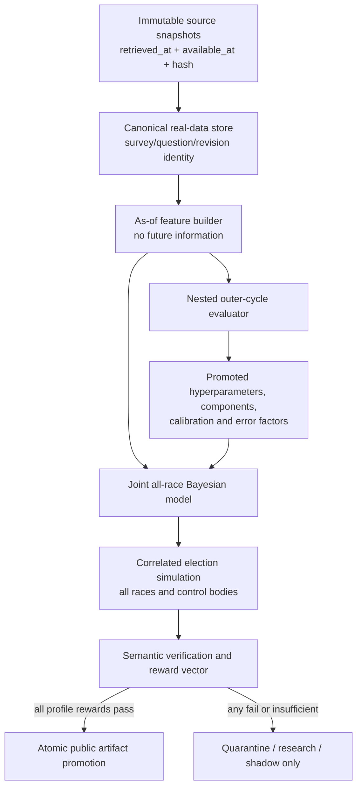

# Real-World U.S. Election Forecaster Enhancement Plan

Status: proposed implementation program
Audience: statistical-methodology, data-engineering, and production owners
Primary objective: turn Civic Signal from a strong fixture-backed research scaffold into
an evidence-backed, real-data U.S. election forecasting system whose claims can be
independently reproduced and falsified.

## Technical summary

The next version should not be promoted by adding more model complexity to the current
pipeline. Promotion must follow four dependencies in order:

1. production forecasts use only real, legally usable, timestamped data;
2. historical evaluation reconstructs only information available at each forecast date;
3. the exact inference, simulation, calibration, and publication path is evaluated on
   genuinely held-out election cycles; and
4. publication is atomic and impossible when any required scientific or operational
   reward fails.

The program retains the existing vector-reward idea, strengthens `R0` through `R15`, and
adds `R16` through `R27` for the missing real-data, time-travel, nested-validation,
hierarchy, covariance, observation-identity, feature-validity, joint-outcome,
publication-safety, live-source, benchmark, and documentation contracts. No aggregate
score may compensate for a failed reward. A reward is `pass`, `fail`,
`insufficient_evidence`, or `not_applicable`; only `pass` satisfies a promotion gate.

Until the public-production profile passes, all forecast outputs must be labeled
`research`, `fixture`, or `shadow` as appropriate. The present fixture-backed Phase 8
status is an orchestration result, not evidence of real-world forecasting skill.

## Why the current pipeline cannot skip these stages

The July 2026 review found concrete blockers in every promotion layer:

- the House and Senate “live” registries currently extend synthetic registries, while
  the configured FiveThirtyEight congressional feeds yield no usable rows;
- synthetic congressional polls are derived from the scenario/result value plus noise
  and repeated across dates, so they validate plumbing rather than forecasting skill;
- the current meta-model learns weights and calibration from the rows it later scores,
  and the scored backtest does not run the exact final simulation path;
- candidate-level residuals are averaged within race/geography, causing complementary
  D/R errors to cancel and leaving covariance floors to supply the apparent structure;
- the Bayesian simulation center comes from posterior draws while the admitted ensemble
  affects uncertainty but not the published center;
- only polled races enter the fitted state space; unpolled races do not share a fitted
  national environment in the joint sampler;
- the daily-update path resummarizes the anchor posterior without applying new-poll
  likelihoods, and the publication verifier can accept semantically invalid or stale
  cross-engine artifacts; and
- the current saved House and Senate NUTS runs contain divergences and fail their own
  posterior-quality reward.

These are structural evidence problems. Tuning the sampler or adding another signal
before fixing them would not make the forecast more trustworthy.

## What “best” means

“Best” must mean best supported by predeclared, out-of-sample evidence, not the model with
the most inputs or the most complicated sampler.

### Primary predictive outcomes

- **Race probability skill:** multiclass log score of the exact published race
  probabilities. Binary Brier score is a secondary diagnostic.
- **Aggregate outcome skill:** log score for chamber control and Electoral College
  control, plus ranked probability score or CRPS for seat-count distributions.
- **Vote-share accuracy:** mean absolute error and RMSE of the reference-party two-party
  margin, reported by office and forecast horizon.

### Required guardrails

- calibration intercept, slope, ECE, and reliability diagrams with cycle-clustered
  uncertainty;
- empirical coverage for 50%, 80%, and 90% vote-share and seat intervals;
- zero as-of violations and zero synthetic rows in production;
- sampler convergence, parameter-recovery, and posterior-predictive diagnostics;
- Monte Carlo standard error for every published race/control probability;
- complete source, code, configuration, environment, and training-artifact lineage;
- publication refusal on stale data, fallback use, failed verification, or insufficient
  evidence.

### Evidence standard for a “best evidenced” claim

The claim may be made for a precisely named office/horizon scope only when all of the
following are true:

- the comparison uses the exact published pipeline in outer held-out cycles;
- there are at least six independent general-election cycles for the claimed office when
  usable real-time data exist; a cross-office national claim must include at least two
  presidential and two midterm cycles, and a House claim must cover both sides of a
  redistricting boundary;
- the model beats every predeclared simple baseline in mean log score and Brier score;
- the cycle-clustered 95% confidence interval for log-score difference versus the primary
  polling-average baseline is entirely below zero;
- the model is non-inferior to each available archived public-forecast comparator by no
  more than `0.005` mean log score, with the comparison definition frozen before scoring;
- calibration, interval coverage, and all production rewards pass without waivers.

If the independent-cycle count is too small, the correct state is
`insufficient_evidence`, not `pass`.

## Scope and non-goals

Initial production scope is U.S. presidential general elections, U.S. Senate general
elections, U.S. House general elections, and gubernatorial general elections. Primaries,
runoffs, ranked-choice elections, ballot measures, turnout forecasts, and administrative
risk remain separate experimental scopes until they have their own data contracts and
reward profiles. They must not inherit a production label from general-election rewards.

This plan does not prescribe a commercial polling-data vendor. Source licensing,
redistribution, retention, and attribution must be resolved before a source can be marked
production. Synthetic panels remain useful for deterministic tests and parameter
recovery, but never for real-world skill measurement or production source coverage.

## Target architecture



## Promotion stages

| Stage | Permitted use | Entry condition | Exit evidence |
|---|---|---|---|
| P0 — Research-safe | Fixtures and local research only | Existing repository | Claims are corrected; production publication is blocked by default; reward-v2 registry exists |
| P1 — Data-grounded | Real-data development | P0 passes | Production registry has zero synthetic rows; immutable snapshots and as-of audits pass |
| P2 — Retrospectively valid | Historical model comparison | P1 passes | Nested exact-pipeline backtests, recovery tests, calibration, and uncertainty gates pass |
| P3 — Live shadow | Scheduled forecasts not presented as public probabilities | P2 passes | Live-source freshness, operational update, publication-verifier, and shadow stability pass for at least 60 consecutive days or a predeclared election-cycle window |
| P4 — Public production | Public race and control probabilities | Every production reward passes | Immutable promoted run plus content-hashed reward, data, model, and verification manifests |

Promotion is scope-specific. Passing Senate does not promote House, and passing T-7 does
not promote T-90. A profile records office, election type, horizon bucket, inference
engine, model version, source-registry version, and training-cycle set.

## Workstream 0 — Make research and production impossible to confuse

**Result:** current fixture-backed artifacts cannot be mistaken for a production forecast.

### Implementation

- Add `publication_mode: research|shadow|production` to configuration, defaulting to
  `research` until P4 passes.
- Add visible `forecast_status`, `evidence_scope`, and `promotion_profile_id` fields to
  every report and forecast artifact.
- Remove or qualify “production default,” “production promoted,” and “live scope
  sufficient” language that is not supported by production rewards.
- Create `configs/rewards.yaml` as the single threshold and profile registry. Python code
  must not contain hidden reward thresholds.
- Implement `verify rewards --profile <name>` and make every reward evaluator return the
  standard state, metric, threshold, evidence paths, and failure reasons.
- Make `fail` and `insufficient_evidence` hard publication blockers for every reward
  required by the selected profile.
- Split fixture verification from production verification. Fixture success may prove
  schemas and orchestration only.

### Deliverables

- `configs/rewards.yaml`
- `reward_card_v2.json`
- `promotion_manifest.json`
- explicit fixture, research, shadow, and production verification profiles
- corrected README, SPEC, methodology, readiness, and model-card wording

### Verification

```bash
uv run civic-signal verify rewards --profile production --run-id fixture-only
```

The command must exit nonzero and identify real-data, nested-backtest, and publication
rewards as failed or insufficient. A test must prove that changing an artifact label from
`research` to `production` without a verified promotion manifest fails semantic
verification.

## Workstream 1 — Build an immutable, real-data election warehouse

**Result:** a forecast can be reconstructed from the exact records that existed at its
as-of timestamp.

### Canonical entities

- **Source snapshot:** source ID, canonical URL/path, retrieved time, source-published
  time, content hash, parser name/version/arguments, authentication mode, license/terms,
  status, row count, original snapshot time, and downstream tables.
- **Race and option:** stable IDs across revisions, office, geography, district, election
  stage, election date, seat/control metadata, party, candidate identity, incumbent/open
  seat, special-election and redistricting-era fields.
- **Poll survey:** `survey_id`, pollster organization and lineage, sponsor and sponsor
  party, mode, population, sample frame, sample size, weighting method, field dates,
  publication time, source revision, and overlap/batch identifiers.
- **Poll question:** `question_id`, survey ID, office/geography, candidate set, response
  basis, undecided/other treatment, question wording where legally retainable, and one
  normalized reference-party margin observation.
- **Official result:** certified/recount status, result version, reported/available time,
  total votes, candidate votes, two-party share, and source jurisdiction.
- **Fundamental snapshot:** partisan baseline, incumbency, finance, ratings, economy,
  approval, generic ballot, demographics, and turnout history, each with observation,
  release, revision, and availability timestamps.
- **Market quote:** contract identity, resolution rules, quote time, bid/ask, volume, open
  interest, venue, fees, and resolved outcome.

### Implementation

- Physically separate `fixtures`, `research`, and `production` source registries. A
  production registry may not extend or import a fixture registry.
- Store every raw response under a content hash and maintain an append-only snapshot
  index. Never overwrite the only pointer to an older historical response.
- Preserve zero-row, failed, stale-reused, rate-limited, and schema-changed states. Do not
  relabel them as successful or reset the original snapshot age.
- Define explicit source priority and deduplication rules. A synthetic or lower-priority
  row can never win because of file order.
- Build historical official-result and race catalogs before model training. Race IDs must
  survive candidate-name corrections and source revisions.
- Obtain real historical poll archives with publication timestamps and legally usable
  retention terms. A final corrected archive without revision history is not sufficient
  for real-time reconstruction.
- Add real-time or release-vintage macro data, timestamped finance snapshots, district
  baselines/PVI, incumbency/open-seat status, generic ballot and approval, race ratings,
  and market snapshots where available.

### Verification

```bash
uv run civic-signal data audit \
  --registry configs/sources_production.yaml \
  --as-of 2026-07-09 \
  --profile production \
  --run-id data-audit-20260709
```

The audit must prove zero fixture/synthetic source IDs, zero unlicensed sources, complete
hash and parser lineage, explicit status for every configured source, original snapshot
age, and production race/baseline coverage. Deleting a required license, replacing a
real poll with a fixture source, or returning a header-only feed must make the audit fail.

## Workstream 2 — Enforce as-of correctness and feature validity

**Result:** no fold or live forecast can see a record before it was actually available.

### Implementation

- Add `observed_at`, `published_at`, `available_at`, and `revision_id` where applicable.
  `available_at` is the sole default field for forecast-time eligibility.
- Filter source records before tiering, deduplication, feature aggregation, and model
  fitting. Recompute tiers separately for every as-of cut.
- Count unique surveys/questions and independent pollsters, not candidate-option rows.
- Select exactly one eligible feature snapshot per race and feature family for each
  forecast date. Training may not join an outcome to every historical feature snapshot.
- Use vintage macro releases rather than current revised values for historical folds.
- Timestamp FEC and rating data; enforce report/release dates rather than end-of-cycle
  totals.
- Sign economic and approval features relative to the incumbent White House party.
- Record the full eligibility predicate and selected snapshot IDs in a feature-lineage
  artifact.
- Implement randomized time-travel tests that insert a future record and prove it cannot
  alter any earlier feature, tier, posterior, or forecast fingerprint.

### Verification

```bash
uv run civic-signal verify as-of \
  --scenario-family national-generals \
  --cycles 2004:2024 \
  --offsets 180,120,90,60,30,14,7,1 \
  --run-id as-of-audit-v1
```

Required result: zero eligible rows with `available_at > as_of`, zero future feature
lineage IDs, one selected snapshot per feature key, and identical pre-cutoff artifacts
before and after adversarial future records are inserted.

## Workstream 3 — Replace the current backtest with nested exact-pipeline evaluation

**Result:** historical scores measure the system that would actually have been published.

### Evaluation design

- **Outer fold:** hold out one complete election cycle. All model training,
  hyperparameters, source-quality estimates, covariance, component admission, ensemble
  weights, and calibration must be learned only from earlier cycles.
- **Inner folds:** within the outer training set, select hyperparameters, components,
  stacking weights, and calibration. Inner validation rows never contribute to their own
  fitted meta-model.
- **Publication replay:** run the exact inference engine, backend, simulation, calibration,
  tier, and publication code on the held-out cycle at each supported horizon.
- **Scoring grain:** one race-level multiclass outcome per race/horizon and one aggregate
  outcome per body/horizon. Candidate complements are not independent observations.
- **Uncertainty:** report paired cycle-clustered bootstrap intervals. Keep cycle count,
  race count, and effective sample size separate.

### Implementation

- Remove implicit backtest fitting from `forecast run`. Forecasts may consume only an
  explicitly promoted, lineage-compatible training bundle.
- Key every promoted artifact by inference engine/backend, model hash, source registry,
  training cycles, office scope, horizons, and target estimand.
- Reject calibration, covariance, weights, or hyperparameters with mismatched lineage.
- Run `SimulationEngine` inside every scored outer fold and score the emitted artifacts,
  not component proxies.
- Implement every declared baseline: prior-only, previous-cycle swing, fundamentals-only,
  polling average, market-implied where eligible, and archived public forecasts where
  definitions align.
- Compare components through matched-coverage leave-one-component-out ensemble ablation.
  Missing component values may not be filled with the baseline and counted as skill.
- Predeclare benchmark metrics and practical thresholds before opening held-out scores.

### Verification

```bash
uv run civic-signal backtest nested \
  --scenario-family national-generals \
  --outer-cycles 2004:2024 \
  --offsets 180,120,90,60,30,14,7,1 \
  --inference-engine bayes \
  --bayesian-backend nuts \
  --run-id nested-v1
```

The fold manifest must prove that every training artifact predates the outer cycle and is
engine/source/model compatible. A canary feature equal to the held-out result must be
rejected or yield no score improvement. Permuting future-cycle outcomes must not change
earlier-fold predictions.

## Workstream 4 — Fit one coherent, all-race election model

**Result:** national and office information propagates to every race while local evidence
can still override the shared environment.

### Model specification

- Use a reference-party two-party margin or log-ratio as the primary latent for D/R
  general elections. Use a logistic-normal simplex with an explicit reference option for
  multi-option races.
- Include every race in the joint model, not only races with polls.
- Fit a national election environment, office-specific loadings, region/state effects,
  district elasticity/PVI, incumbency/open-seat effects, Senate class, redistricting-era
  effects, and local race residuals.
- Model the latent trajectory through time with a reverse random walk or similarly
  auditable dynamic process anchored on Election Day.
- Give every race a fundamentals prior mean and variance. Prior uncertainty must enter
  the generative model rather than only the exported artifact.
- Allow generic ballot, approval, and national polling to update the shared environment,
  thereby moving unpolled House and Senate races coherently.
- Model pollster-by-cycle and party bias, industry-wide cycle error, mode/population,
  sponsor, likely-voter screen, overlapping samples, and question-level nonsampling
  error. Do not subtract a house effect and then fit the same effect again.
- Treat undecided and other responses explicitly. Clearly label two-party share versus
  total vote share.
- Treat same-party contests, independents, runoffs, and ranked-choice elections as
  distinct estimands with separate eligibility gates.

The design should preserve the current party-signed margins, heavy-tailed local errors,
deterministic seed structure, and auditable configuration. Dynamic hierarchical election
models such as [Linzer's state-level model](https://votamatic.org/wp-content/uploads/2013/07/Linzer-JASA13.pdf)
and the [updated Economist-style model](https://hdsr.mitpress.mit.edu/pub/nw1dzd02/release/2)
are methodological anchors, not code to reproduce mechanically.

### Verification

- Simulation-based calibration across national, office, state, race, trajectory,
  pollster, and bias parameters.
- Parameter-recovery suites with known national waves, regional shocks, pollster bias,
  industry-wide bias, trends, sparse polling, and conflicting fundamentals.
- Label-symmetry tests: swapping party labels and signs must swap forecast probabilities.
- Option-order invariance tests.
- Unpolled-race propagation: a known national shock must move unpolled races in the
  expected direction and magnitude distribution.
- Prior-to-posterior tests proving weak data retain prior uncertainty while strong data
  dominate it.
- Prior and posterior predictive checks by office, horizon, tier, pollster, and cycle.

```bash
uv run civic-signal verify recovery --suite hierarchy,polls,trajectory --run-id recovery-v1
```

## Workstream 5 — Rebuild error factors, simulation, calibration, and control

**Result:** uncertainty is learned from independent historical errors and remains coherent
from race draws through aggregate control outcomes.

### Implementation

- Compute one signed margin residual per race. Never average complementary option
  residuals.
- Estimate national, regional/state, and office factor errors at the cycle level. Treat
  absent geographies as missing, not zero.
- Use a low-rank structural factor model appropriate to the number of independent
  cycles. Report the effective cycle count and shrinkage target.
- Validate factor recovery using synthetic data with known covariance before promotion.
- Ensure Bayesian posterior centers, admitted external signals, and forecast-error layers
  form one documented predictive distribution. Do not let the ensemble affect only sigma
  while claiming it shifts the forecast.
- Fit probability calibration only on out-of-fold raw simulated probabilities. Calibrate
  one reference-party probability and derive its complement; use a proper multiclass
  transform for multi-option races.
- Either calibrate the latent draw distribution or validate/calibrate race, seat-count,
  chamber-control, and Electoral College outcomes separately.
- Maintain internal conservative draws for every control-bearing seat even when public
  Tier C race probabilities are withheld. Otherwise withhold the aggregate control
  probability.
- Model Maine and Nebraska at-large and congressional-district electors separately.
- Couple presidential-cycle Senate ties to the simulated presidential/vice-presidential
  outcome; use party-specific control thresholds in nonpresidential cycles.
- Use adaptive simulation until the Monte Carlo standard error of every published
  probability is at most `0.0025`; this is approximately 40,000 independent draws near
  50% before autocorrelation or weighting adjustments.

### Verification

```bash
uv run civic-signal verify recovery --suite covariance,simulation,control --run-id recovery-v1
uv run civic-signal verify coherence --run-id <forecast-run-id>
```

The tests must recover injected factor variances within configured tolerances, produce a
positive-semidefinite covariance matrix, preserve option probability sums, reconcile race
winners to seat/EC totals exactly, reproduce Maine/Nebraska and Senate-tie fixtures, and
meet MCSE limits. Deliberately averaging D/R residuals must fail the covariance-recovery
reward.

## Workstream 6 — Make updates, failover, and publication real

**Result:** operational convenience can never silently change the statistical algorithm
or publish an invalid run.

### Daily updates

- Compute the likelihood of new poll questions for each stored posterior draw.
- Normalize importance weights and report actual ESS, weight entropy, and Pareto-k or an
  equivalent tail diagnostic.
- Resample/rejuvenate or perform a full refit when weights degenerate, the anchor is too
  old, model/config/source lineage changes, or drift exceeds tolerance.
- Compare update output against a full refit on a scheduled sample of historical and live
  dates.
- If a valid incremental algorithm is not ready, make `forecast update` perform an
  explicit full refit rather than certifying a no-op.

### Failover

- Implement every configured fallback literally: previous-posterior reuse, SVI,
  analytic, Kalman, or full refusal must have separate code paths and eligibility rules.
- Record the algorithm actually executed, input posterior lineage, trigger, runtime, and
  changed uncertainty semantics.
- General model exceptions must not be converted into a publishable fallback.
- Any fallback configured as publication-blocking must write only to quarantine.

### Atomic publication

- Write each attempt to a new temporary run directory with an immutable attempt ID.
- Perform semantic schemas, cross-artifact reconciliation, fingerprint, reward, and
  engine-specific artifact checks before promotion.
- Atomically rename or register only a passing run. Never reuse a directory across engines
  or attempts.
- Include code commit/tree state, `uv.lock`, Python/JAX/NumPyro versions, platform,
  configs, source manifest, training bundle, CLI invocation, seeds, and status-bearing
  diagnostics in the fingerprint.
- Verify finite values, data types, unique keys, allowed ranges, option sums, interval
  ordering, draw counts, seat totals, and exact race/control reconciliation.

### Verification

```bash
uv run civic-signal verify update --anchor <run-id> --against-full-refit
uv run civic-signal verify failover --suite all
uv run civic-signal verify publication --run-id <attempt-id> --profile production
```

Mandatory corruption tests set probabilities to `1.5`, add duplicate keys, remove draws,
mix engine-specific artifacts, alter a status field, reuse a stale calibration map, and
force a fallback. Every mutation must fail verification and leave the last promoted run
unchanged.

## Workstream 7 — Make the tests exercise the science

**Result:** CI proves more than artifact shape.

### Implementation

- Restore the existing repository gate and require true unrounded line coverage of at
  least 90%. Add branch coverage and remove broad inference/CLI exclusions.
- Add CLI subprocess tests for every production command and nonzero failure path.
- Run a tiny real NUTS smoke test in normal CI; run larger SBC, recovery, posterior
  predictive, and divergence stress suites nightly.
- Add real golden artifacts for one small election, one chamber, one multi-option race,
  and one failure/quarantine case.
- Add property tests for party-label symmetry, option-order invariance, probability
  simplex constraints, interval ordering, covariance PSD, and control reconciliation.
- Add Numba/Python and serial/parallel numerical parity tests with deterministic
  fingerprint expectations.
- Add recorded-contract live-source tests and scheduled canaries for schema changes,
  redirects, gzip, rate limits, timeouts, malformed payloads, empty feeds, and stale
  caches.
- Add mutation testing for reward and publication-verification code. A verifier whose
  range, lineage, or hard-gate check is removed must cause a test failure.
- Generate documentation assertions from configuration/schema metadata where possible;
  fail CI when README/SPEC/model-card claims disagree with active config.

### Verification

```bash
uv sync
uv run ruff check
uv run ruff format --check
uv run coverage run -m pytest
uv run coverage report --precision=2 --fail-under=90
uv run civic-signal benchmark run --as-of 2026-05-08 --run-id perf
```

CI must also run the reward negative-test matrix. A reward without at least one passing
fixture and one adversarial failing fixture is incomplete.

## Workstream 8 — Shadow forecasting and benchmark promotion

**Result:** the system demonstrates stable performance on unseen live data before public
release.

### Implementation

- Run scheduled shadow forecasts using frozen as-of data and immutable run IDs.
- Publish no public probabilities during shadow mode; store timestamped artifacts and
  source-health reports.
- Reconcile every later source correction and official result to the original forecast
  snapshot without rewriting history.
- Monitor freshness, source coverage, poll movement, posterior drift, sampler health,
  update-versus-refit differences, calibration, MCSE, and fallback frequency.
- Pre-register the primary model and baselines for each election cycle. Freeze the model
  before the final evaluation window; post-freeze repairs require a new version and
  separate score line.
- Produce office/horizon scorecards with cycle-clustered uncertainty and public-model
  comparison definitions.
- Require at least 60 consecutive shadow days or an equivalent predeclared election-cycle
  window with no silent publication failures, no unresolved source-age breach, and no
  unquarantined fallback before P4.

### Verification

```bash
uv run civic-signal verify shadow \
  --profile 2026-general-production \
  --window-start <date> \
  --window-end <date>
```

The shadow report must identify every scheduled run, missing run, stale source, fallback,
full refit, promotion refusal, and corrected input. Missing schedules or incomplete
history cannot be converted into a pass.

## Reward-v2 contract

Every reward record must contain:

```yaml
reward_id: R00
state: pass|fail|insufficient_evidence|not_applicable
scope:
  offices: []
  election_types: []
  horizon_buckets: []
metric: {}
threshold: {}
evidence: []
lineage: {}
negative_tests_passed: []
failure_reasons: []
blocks_publication: true
```

Thresholds live in `configs/rewards.yaml`. A missing metric, missing evidence file,
unrecognized scope, or NaN becomes `insufficient_evidence` or `fail`, never `pass`.
Production verification recalculates rewards from primary artifacts; it does not trust a
previously written Boolean.

### Strengthened existing rewards

| Reward | Exact production pass rule | Required evidence | Mandatory adversarial proof |
|---|---|---|---|
| `R0_build` | All required commands pass; raw line coverage is at least 90.00%; production CLI and inference code are included | CI manifest, coverage JSON, tool versions | A 89.99% coverage fixture and a failing CLI test both block |
| `R1_reproducibility` | Two clean runs from the same immutable inputs/config/code produce identical canonical scientific artifacts; volatile metadata is separated, not globally ignored by field name | two run manifests, canonical hashes, environment lock | Changing a diagnostic status, source identity, parser version, or model config changes the fingerprint |
| `R2_provenance` | 100% of published rows and draws resolve to source snapshots, training bundle, model/config hash, code commit/tree, environment, and CLI invocation | row lineage, run manifest, source/training manifests | Remove any lineage edge and verification fails |
| `R3_sync_integrity` | Every configured source has an honest status; no stale item exceeds its TTL; original snapshot age is preserved; row-count and schema expectations pass | sync audit, freshness report, snapshot index | Empty feed, stale reuse, parser drift, auth failure, and duplicate revision each fail |
| `R4_calibration` | Exact outer-fold published probabilities have ECE ≤ 0.04 overall, bootstrap 95% upper bound ≤ 0.06, absolute intercept ≤ 0.05, and slope in [0.8, 1.2], with office/horizon breakdowns | outer predictions, calibration report, bootstrap draws | Fit calibration on its scored rows and the fold-lineage test fails |
| `R5_baseline_competition` | Model beats every simple baseline in mean log and Brier score; primary log-score paired 95% CI is below zero; required independent-cycle count passes | paired benchmark report, cycle scores, preregistration | Relabel repeated horizons/options as independent and effective-n test fails |
| `R6_component_admission` | Component improves matched-coverage ensemble performance in nested leave-one-component-out analysis without degrading calibration/coverage beyond thresholds | inner/outer ablations, coverage map, promoted component manifest | Baseline-filled missing estimates or standalone-only comparisons fail |
| `R7_sparse_honesty` | Public Tier C probabilities are null; all control-bearing races still have internal conservative draws, or aggregate control is withheld | race catalog, public forecasts, internal draw coverage, control policy | Remove sparse seats from control simulation and reconciliation fails |
| `R8_uncertainty_quality` | 50/80/90% interval point coverage is within ±0.05 of nominal and cluster-bootstrap intervals include nominal, by supported office/horizon | coverage report and bootstrap draws | Candidate complements/repeated cuts cannot inflate sample size |
| `R9_public_signal_discipline` | Public signals have availability timestamps, pass leakage canaries, and add nested out-of-sample value before becoming trusted | leakage audit, LOCO ablation, source contract | A result-derived or post-as-of signal forces experimental status |
| `R10_explainability` | Contributions reconcile to the model/predictive distribution and every explanation cites actual evidence and uncertainty; no placeholder driver is accepted | contribution reconciliation and explanation schema | Mutating a contribution or driver source causes mismatch failure |
| `R11_plot_contract` | All required plots/tables are source-backed, finite, labeled with estimand/scope, referenced in manifest, and render from the same verified data | plot manifest, rendered outputs, source IDs | Stale or source-less plot, wrong scale, or missing office/horizon label fails |
| `R12_performance_contract` | Requested/actual engine and parallelism match; numerical parity passes; no >10% wall-clock regression versus accepted benchmark unless explicitly approved; every probability meets MCSE | performance and parity reports | Python/Numba or serial/parallel output drift beyond tolerance fails |
| `R13_posterior_quality` | Zero divergences; R-hat ≤ 1.01; bulk and tail ESS ≥ 400 for monitored parameters; E-BFMI > 0.3; draw/chain IDs truthful; recovery/SBC profile passes | diagnostics, chain summary, SBC/recovery artifacts | Fake sampler output, one-chain mislabeled as two, or forced funnel divergence fails |
| `R14_calibrated_publication` | Calibration map is outer-fold, engine/model/source compatible; binary complements and multiclass simplexes remain coherent; control calibration is validated separately | calibration lineage, raw/calibrated predictions, coherence report | Mismatched map, non-summing candidates, or uncalibrated control artifact fails |
| `R15_daily_update_quality` | New data alter likelihood weights; actual diagnostics pass; probability MAE versus full refit ≤ 0.005 and maximum difference ≤ 0.02 on audit dates; otherwise full refit occurs | update weights, ESS/Pareto diagnostics, full-refit comparison | No-op update, old anchor, conflicting polls, or degenerate weights trigger full refit/fail |

### New rewards required for real-world promotion

| Reward | Exact production pass rule | Required evidence | Mandatory adversarial proof |
|---|---|---|---|
| `R16_real_data_exclusivity` | Production inputs contain zero synthetic/fixture/generated-outcome rows; race/results/baseline coverage is complete for the claimed scope; live signal coverage is reported honestly rather than requiring polls in every race | registry audit, source classifications, race coverage | Insert one fixture source into production and the run is quarantined |
| `R17_as_of_integrity` | 100% of selected records satisfy `available_at ≤ as_of`; revision/vintage selection is deterministic; future-record canaries cause no pre-cutoff change | as-of audit and feature lineage | Future finance, macro revision, poll correction, or tier row cannot alter earlier forecasts |
| `R18_nested_evaluation` | Every scored row comes from an outer cycle excluded from all fitting and artifact promotion; exact publication pipeline and matching engine are used | fold lineage, training manifests, exact-pipeline flag | Permuting held-out outcomes or future cycles cannot change prior-fold forecasts |
| `R19_covariance_recovery` | One signed residual per race; no missing-as-zero; covariance is PSD; known factor variances recover within 20% and correlation RMSE ≤ 0.10 in recovery suites | residual table, factor fit, recovery report | Complement averaging and injected wrong-sign factors fail |
| `R20_all_race_hierarchy` | Every control-bearing race is represented in the joint predictive model; national/office/state information propagates to unpolled races; parameter recovery and label symmetry pass | model index, hierarchy diagnostics, recovery report | Remove unpolled races or zero the national loading and recovery fails |
| `R21_poll_observation_identity` | Every modeled poll margin maps to one canonical survey question/revision; no option double count; sponsor/mode/population/overlap metadata and pollster lineage are auditable | poll observation manifest and dedupe report | Duplicate candidate rows, revised questions, overlapping samples, and same-day questions do not double count |
| `R22_feature_validity` | Exactly one eligible snapshot per race/feature/horizon; economic sign is incumbent-relative; finance/macro/ratings are vintage-correct; feature estimands are documented | feature lineage, sign tests, vintage audit | End-of-cycle finance and revised macro values cannot enter early folds |
| `R23_joint_outcome_coherence` | Probabilities are finite/in-range/sum to one; draws reconcile exactly to race winners, seat totals, chamber control, EC, ME/NE allocation, and VP tiebreak logic | semantic verification and reconciliation tables | Probability 1.5, duplicate winner, missing seat, wrong ME/NE elector, or static Senate threshold fails |
| `R24_atomic_publication` | Only a new immutable attempt that passes every required reward and semantic check can replace the promoted pointer; failures and fallbacks remain quarantined | attempt/promotion manifests, atomicity audit | Corruption or failure during any stage leaves last promoted run byte-identical |
| `R25_live_source_resilience` | Recorded contracts and canaries pass for schema drift, empty responses, compression, redirects, rate limits, timeouts, malformed data, corrections, and stale TTL; alerts name affected scope | adapter contracts, canary history, alert report | Each injected failure produces the correct non-success status and blocks affected scope |
| `R26_benchmark_superiority` | The “best evidenced” criteria above pass for a named office/horizon scope with preregistered comparisons and cycle-clustered uncertainty | preregistration, comparator snapshots, paired score report | Removing a difficult cycle, changing metric after scoring, or comparing mismatched scopes invalidates the claim |
| `R27_contract_parity` | README, SPEC, methodology, configs, schemas, CLI help, model card, and implemented behavior agree; generated contract tests find no stale claim | parity report and documentation tests | Change target acceptance, calibration cap, chain method, source scope, or default engine in one place and CI fails |

## Production profile

A public general-election forecast requires all of the following rewards to be `pass`:

```text
R0-R8, R10-R27
```

`R9` is required only if public-signal features are admitted; otherwise it must pass the
discipline rule that they remain experimental. `not_applicable` is permitted only for a
truly out-of-scope feature such as Electoral College allocation in a midterm-only profile,
and the scope reason must be machine-readable.

## Proposed verification command surface

These commands are part of the plan and do not exist until implemented:

```bash
# Data and time-travel proof
uv run civic-signal data audit --profile production --as-of <date> --run-id <id>
uv run civic-signal verify as-of --scenario-family <family> --run-id <id>

# Scientific validation
uv run civic-signal backtest nested --scenario-family <family> --run-id <id>
uv run civic-signal verify recovery --suite all --run-id <id>
uv run civic-signal verify coherence --run-id <forecast-id>

# Operations and publication
uv run civic-signal verify update --anchor <forecast-id> --against-full-refit
uv run civic-signal verify failover --suite all
uv run civic-signal verify publication --run-id <attempt-id> --profile production
uv run civic-signal verify rewards --run-id <attempt-id> --profile production
uv run civic-signal verify shadow --profile <profile-id> --window-start <date> --window-end <date>
```

Every command must emit JSON plus a human-readable report, return nonzero on `fail` or
`insufficient_evidence`, and record its input hashes. Commands must never modify a
promoted artifact while verifying it.

## Dependency-ordered implementation backlog

| Milestone | Work | Depends on | Relative effort | Rewards unlocked | Completion evidence |
|---|---|---|---|---|---|
| M0 | Claim reset, reward-v2 schema, profiles, hard publication block, current lint/coverage repairs | none | Medium | R0, R24, R27 foundation | Fixture production attempt fails; clean repository gate passes |
| M1 | Production source registry, immutable snapshot index, canonical race/result/poll schemas, terms audit | M0 | Very high | R2, R3, R16, R21, R25 foundation | Real-data audit with zero synthetic rows |
| M2 | Historical real-time archive, as-of feature builder, macro/finance/ratings vintages, tier recomputation | M1 | Very high | R17, R22 | Time-travel canaries and historical snapshot audit pass |
| M3 | Nested outer-cycle exact-pipeline evaluator, all baselines, paired uncertainty, lineage-compatible promotion | M2 | Very high | R4-R6, R8, R18, R26 foundation | Held-out fold lineage and canary leakage tests pass |
| M4 | All-race hierarchical model and poll likelihood redesign | M2, M3 | Very high | R13, R20, R21, R22 | SBC, recovery, PPC, symmetry, and unpolled propagation pass |
| M5 | Factor covariance, coherent ensemble/calibration, complete simulation/control logic, adaptive MCSE | M3, M4 | High | R7, R8, R12, R14, R19, R23 | Recovery and exact reconciliation suites pass |
| M6 | Real incremental update/full-refit policy, literal failovers, immutable atomic publication, semantic verifier | M4, M5 | High | R1, R15, R24 | Corruption/fallback/update equivalence matrices pass |
| M7 | Real NUTS CI, golden artifacts, property/mutation/live-contract tests, docs parity | M1-M6 | High | R0, R10-R13, R25, R27 | CI/nightly matrix and benchmark gate pass |
| M8 | Scheduled shadow operation, frozen preregistration, external benchmark scoring, public promotion | M1-M7 | Calendar-bound | R26 and complete profile | Shadow window and every production reward pass |

M4 and M5 must not be declared complete using synthetic forecast skill. Synthetic data is
permitted only for recovery tests where the data-generating parameters are explicitly
known.

## Required artifacts by milestone

```text
artifacts/
  data_audits/<run_id>/
    source_registry_audit.json
    snapshot_index_audit.parquet
    race_coverage.parquet
    terms_audit.json
  as_of_audits/<run_id>/
    as_of_audit.json
    selected_feature_lineage.parquet
    time_travel_canaries.json
  backtests/<run_id>/
    preregistration.json
    fold_lineage.parquet
    training_manifests/
    outer_predictions.parquet
    race_scorecard.json
    control_scorecard.json
    paired_benchmarks.json
    calibration_report.json
    coverage_report.json
  recovery/<run_id>/
    sbc_summary.json
    hierarchy_recovery.json
    poll_bias_recovery.json
    covariance_recovery.json
    simulation_reconciliation.json
  attempts/<attempt_id>/
    run_manifest.json
    reward_card_v2.json
    semantic_verification.json
    publication_decision.json
  promoted/<profile_id>/
    promotion_manifest.json
  shadow/<profile_id>/
    schedule_history.parquet
    source_health.parquet
    update_refit_comparison.parquet
    shadow_readiness.json
```

## Definition of done for each implementation task

No backlog item is complete until all seven conditions hold:

1. implementation and configuration are explicit and auditable;
2. deterministic positive tests pass;
3. at least one adversarial negative test proves the reward can fail;
4. a machine-readable evidence artifact is written;
5. the relevant reward is recomputed from primary evidence;
6. README and SPEC are updated if behavior or contracts changed; and
7. the repository gate and relevant performance benchmark pass.

A screenshot, a successful command exit without inspected evidence, a fixture-only
result, or a point estimate without uncertainty is not completion evidence.

## Known decisions that must be resolved before M1 promotion

- Which historical and live polling archives have adequate timestamp/revision history
  and redistribution rights?
- Which offices and horizons are the first public-production scope?
- Will prediction markets be a model input, a benchmark only, or both with separate
  anti-leakage rules?
- What scheduled forecast cadence and maximum source TTL apply at each horizon?
- Which archived external forecasts have sufficiently aligned estimands and timestamps
  for fair comparison?
- What computational budget is available for full nested NUTS evaluation and nightly
  recovery suites?

These decisions affect scope and cost, not the validity requirements. Until resolved,
their dependent rewards remain `insufficient_evidence`.

## Immediate next implementation slice

The first executable slice should be M0 plus the schema-only part of M1:

1. add the reward-v2 schema and `configs/rewards.yaml`;
2. add publication profiles and make `research` the default;
3. make every current reward a hard, recomputed profile input;
4. add semantic probability/key/reconciliation verification and corruption tests;
5. create physically separate fixture and production source registries;
6. define canonical source-snapshot, survey, question, revision, and availability schemas;
7. repair the current lint/format/coverage gate; and
8. update SPEC/README/readiness language so no fixture artifact can imply production.

That slice produces immediate safety value without pretending the real-data warehouse or
forecasting model is already complete.
