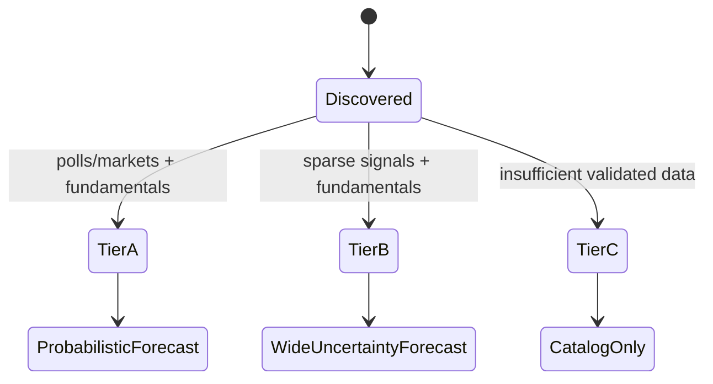
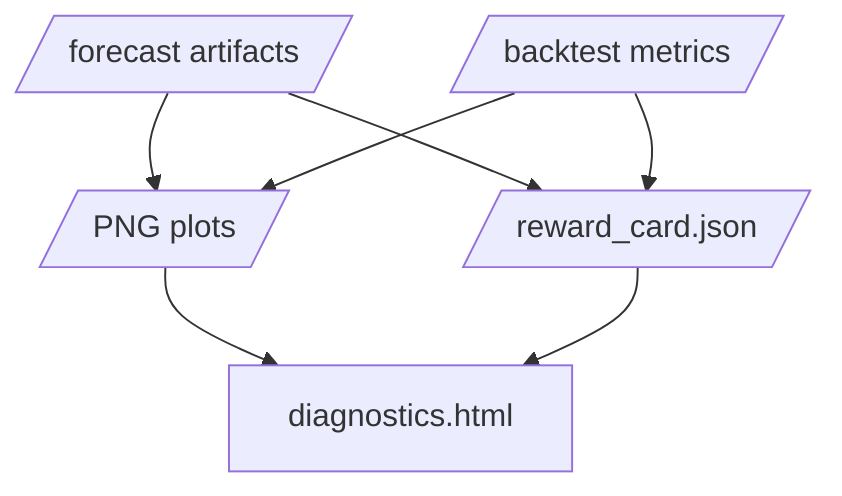

# Technical Appendix

This appendix describes the statistical target, data contracts, model components,
simulation approach, diagnostics, and performance design for the election forecasting
engine.

## 1. Forecasting Objective

The engine estimates distributions over election outcomes, not just point predictions.
The primary unit is a race-option pair:

```text
race_id, option_id, election_date, race_type, geography, office_type
```

The canonical latent quantities are:

- Candidate race: election-day vote-share simplex across candidates/options.
- Ballot measure: election-day yes-share and pass/fail probability.
- Control outcome: seat-count or office-control distribution derived from race draws.
- Ecosystem outcome: turnout, recount risk, certification risk, and demographic support
  metadata where available.

The output should answer:

- Who is favored?
- By how much?
- How uncertain is the result?
- Which races decide control?
- Which races are too sparse to forecast honestly?
- Did the model perform well in backtests?
- Which sources and model settings produced this answer?

## 2. Data And Provenance Model

All data enters through `configs/sources.yaml`. Each source must declare:

- `id`: stable source id.
- `table`: logical destination table.
- `type`: source adapter type.
- `path` or URL.
- `parser_version`.
- `license` or terms note.

The sync layer writes immutable raw snapshots and a source manifest:

```text
source_id
table
url
raw_path
retrieved_at
content_hash
license
parser_version
status
error
downstream_usage
```

This creates an audit chain:


The model is not allowed to emit trusted forecasts without lineage. Forecast rows carry
both source-manifest hash and model-config hash.

## 3. Race Catalog And Tiering

The race catalog is the central table for forecast eligibility. Every discovered race is
tracked even when it is not forecastable.

Tier policy:

- Tier A: enough validated polling or market information plus fundamentals to produce
  full probability and margin outputs.
- Tier B: sparse but supported by fundamentals and at least one signal; uncertainty is
  intentionally wider.
- Tier C: tracked but no trusted probability is emitted.

This prevents false precision in local, low-information, or metadata-only races.



## 4. Component Models

The current engine uses deterministic, fixture-backed component models with explicit
upgrade seams for Bayesian and machine-learning replacements.

### 4.1 Polling Component

The polling component estimates current race preference from poll rows:

```text
poll_id, race_id, pollster, start_date, end_date, population,
sample_size, sponsor_class, methodology, option_id, pct
```

Current estimator:

```text
weighted_share(option) =
  sum(weight_poll * poll_pct_option) / sum(weight_poll)

weight_poll =
  sqrt(sample_size)
  * population_weight
  * methodology_weight
  * sponsor_weight
```

The output is converted into a win-probability-like component score through a logistic
mapping around 50 percent share. This is a placeholder for a future hierarchical polling
model.

Planned frontier upgrade:

```text
observed_poll_share =
  latent_vote_share(race, date)
  + pollster_house_effect
  + mode_effect
  + population_effect
  + sponsor_or_internal_effect
  + sampling_error
  + non_sampling_error
```

Trend model:

```text
latent_vote_share(race, date)
  follows time-to-election random walk or Brownian bridge
```

The Bayesian version should estimate pollster effects hierarchically and propagate
polling error into simulation draws.

### 4.2 Fundamentals Component

The fundamentals model predicts prior race share from structural features:

- Previous vote share.
- Partisan lean.
- Incumbency.
- Fundraising proxy.
- Economic index.
- Demographic turnout index.
- Historical turnout.
- Geography and office type.

The current estimator is intentionally transparent:

```text
raw_share =
  previous_vote_share
  + partisan_shift
  + incumbency_adjustment
  + finance_adjustment
  + economic_adjustment
  + demographic_adjustment
```

The result is normalized within race. Future versions should replace this with a
rolling-origin trained model such as regularized regression, gradient-boosted trees, or
a hierarchical Bayesian prior model.

### 4.3 Market Component

The market component treats public market prices as noisy probability observations.
It applies liquidity/spread gates before admission:

```text
admitted_market =
  open_interest >= min_open_interest
  and spread <= max_spread
```

Current output:

```text
win_probability = latest_public_market_probability
vote_share_proxy = 0.5 + (probability - 0.5) * 0.35
```

Markets should never be used for trading in this repo. The model consumes read-only
public market data.

### 4.4 Public-Signal Component

Public signals include news attention, pageviews, official releases, and similar
features. They are high-risk because they can encode popularity, controversy, media
bias, leakage, or post-treatment effects.

Default policy:

- Compute and report public-signal estimates.
- Keep them experimental unless backtests and leakage checks justify admission.
- Require ablation evidence before changing trusted ensemble output.

### 4.5 Ensemble Component

The ensemble combines admitted component outputs with configured weights:

```text
ensemble_score =
  sum(component_weight * component_estimate)
  / sum(component_weight for admitted components)
```

Current trusted components:

```yaml
trusted_components:
  polling: true
  fundamentals: true
  markets: true
  public_signals: false
```

Future versions should learn dynamic weights from rolling-origin backtests:

- More polling weight near election day where polls exist.
- More fundamentals weight early and in sparse races.
- Market weight adjusted for liquidity and historical bias.
- Public signals admitted only when out-of-sample evidence is strong.

## 5. Simulation And Joint Outcomes

The simulation layer converts ensemble point estimates into joint outcome distributions.
It generates race-option draws with:

- National correlated error.
- Race/local heavy-tailed error.
- Tier-specific uncertainty.
- Turnout variation.
- Winner flags.

Two-option race simulation:

```text
share_0_draw =
  clamp(ensemble_share_0 + national_error_draw + local_error_race_draw, 0.02, 0.98)

share_1_draw = 1 - share_0_draw

winner = argmax(share_0_draw, share_1_draw)
```

Control forecasts are derived from draw-level winners by control body and party. This is
important because control probabilities are not independent race probabilities; they are
functions of correlated race outcomes.

Ecosystem forecasts use draw-level outcomes to estimate:

- Turnout mean and intervals.
- Recount probability from close margins.
- Certification-risk probability as a close-margin derived event.
- Ballot-measure support flag.

## 6. Backtesting And Calibration

Backtesting uses historical prediction fixtures and component columns:

```text
baseline_probability
polls_probability
fundamentals_probability
markets_probability
public_signals_probability
ensemble_probability
```

Metrics:

- Brier score.
- Log score.
- Calibration intercept and slope.
- Expected calibration error.
- Interval coverage.

Reward use:

- `R4_calibration` confirms calibration metrics are reported.
- `R5_baseline_competition` checks whether the ensemble beats or matches baseline.
- `R6_component_admission` checks trusted components against ablation evidence.
- `R8_uncertainty_quality` checks interval coverage against tolerance.

Calibration is not optional. A model with visually attractive projections but poor
coverage or poor probability calibration should not be treated as trusted.

## 7. Diagnostics And Plots

Forecast runs produce both machine-readable artifacts and human-readable diagnostics.

Plot families:

- Calibration curve.
- Brier by component.
- Interval coverage.
- Race winner probabilities.
- Vote-share intervals.
- Seat/control projections.
- Turnout and recount-risk projection.
- Tier coverage.

The HTML diagnostics page embeds these visuals and includes reward state, scorecards,
source counts, and backtest payloads.



## 8. Performance Approach

Performance policy:

- Use Polars and DuckDB for table-oriented work.
- Use NumPy arrays for draw-level numerical buffers.
- Use Numba for repeated CPU-bound numerical loops.
- Preserve Python fallback behavior for platforms where acceleration is unavailable.
- Benchmark simulation and scoring changes.

Current accelerated path:

```text
SimulationEngine
  -> collect binary race specs
  -> build dense NumPy arrays
  -> call Numba parallel binary_draw_kernel
  -> map integer race/option ids back to Parquet-ready labels
```

Forecast runs write:

```text
performance.json
```

Benchmark runs write:

```text
artifacts/benchmarks/<run_id>/performance_benchmark.json
```

The performance reward `R12_performance_contract` verifies that the run records the
requested engine, actual engine, parallel mode, Numba availability, thread count, and
simulation count.

## 9. Source Expansion Path

The fixture-backed implementation is designed to make live ingestion incremental rather
than disruptive.

Adapter expansion order:

1. Poll feeds and pollster metadata.
2. Election returns and official race metadata.
3. FEC finance data.
4. Census/BLS/BEA fundamentals.
5. Public market data.
6. Public attention/news/pageview signals.

Each adapter must:

- Record raw payloads or stable downloaded files.
- Hash content.
- Preserve parser version.
- Record auth mode and terms/rate-limit assumptions.
- Fail visibly in the source manifest.
- Produce curated tables compatible with the existing feature layer.

## 10. Limitations

Current limitations:

- Fixture-backed data, not live data.
- Deterministic component models, not full Bayesian estimation yet.
- Static ensemble weights.
- Simplified market and public-signal handling.
- Two-option simulation has the optimized Numba path; multi-option/ranked-choice paths
  still use simpler logic.
- Certification and recount risks are close-margin proxies, not full legal/process
  models.

These limitations are acceptable for the scaffold because the artifact, reward,
diagnostic, and performance contracts are already testable.

## 11. Acceptance Standard

The repo is acceptable only when:

```bash
uv sync
chflags -R nohidden .venv
uv run ruff check
uv run ruff format --check
uv run pytest --cov=src/election_outcomes --cov-fail-under=90
```

A complete diagnostic run should include:

```bash
uv run election-outcomes forecast run --as-of 2026-05-08 --run-id full-diagnostic
uv run election-outcomes backtest run --run-id full-diagnostic-backtest
uv run election-outcomes benchmark run --as-of 2026-05-08 --run-id full-diagnostic-perf
```

